# 🌱 TerraWeek Day 1 – Introduction to IaC & Terraform Basics

## 📚 Learning Summary

Today I learned the fundamentals of **Infrastructure as Code (IaC)** and **Terraform**, installed Terraform CLI, created my first Terraform configuration, provisioned local resources, explored OpenTofu, and understood Terraform's workflow.

---

# Task 1: Understand IaC & Terraform

## What is Infrastructure as Code (IaC)?

Infrastructure as Code (IaC) is the practice of managing infrastructure using code instead of manual configuration. It makes deployments faster, consistent, repeatable, and version-controlled.

> **Read more:**  
> **DevOps Notes →** [Terraform & Infrastructure as Code (IaC)](https://github.com/Jaishree97/DevOps-Notes/blob/main/Terraform/01-terraform-intro.md)

---

## What is Terraform?

Terraform is an open-source Infrastructure as Code (IaC) tool developed by HashiCorp that provisions and manages infrastructure using a declarative language (HCL). It supports multiple cloud providers from a single workflow.

> 📖 **Read more:**  
> **DevOps Notes →** [Terraform & Infrastructure as Code (IaC)](https://github.com/Jaishree97/DevOps-Notes/blob/main/Terraform/01-terraform-intro.md)

---

## Terraform vs Alternatives

| Tool | One-Line Comparison |
|------|----------------------|
| **Terraform** | Multi-cloud declarative Infrastructure as Code tool. |
| **OpenTofu** | Open-source fork of Terraform maintained by the community. |
| **Pulumi** | Uses programming languages instead of HCL. |
| **AWS CloudFormation** | AWS-native Infrastructure as Code service. |
| **Ansible** | Configuration management and automation tool. |

> **Detailed Comparison:**  
> **DevOps Notes →** [Terraform & Infrastructure as Code (IaC)](https://github.com/Jaishree97/DevOps-Notes/blob/main/Terraform/01-terraform-intro.md)

---

# Task 2: Install Terraform

- Installed **Terraform v1.15.x**
- Verified installation using:
  ```bash
  terraform version
  terraform -help
  ```
Installed the **HashiCorp Terraform** extension in VS Code for syntax highlighting and autocompletion.

> **Installation Guide:**  
> **DevOps Notes →** [Terraform Installation & Setup](https://github.com/Jaishree97/DevOps-Notes/blob/main/Terraform/02-terraform-installation-setup.md)

### Verify Terraform Installation

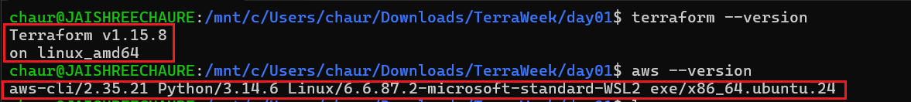

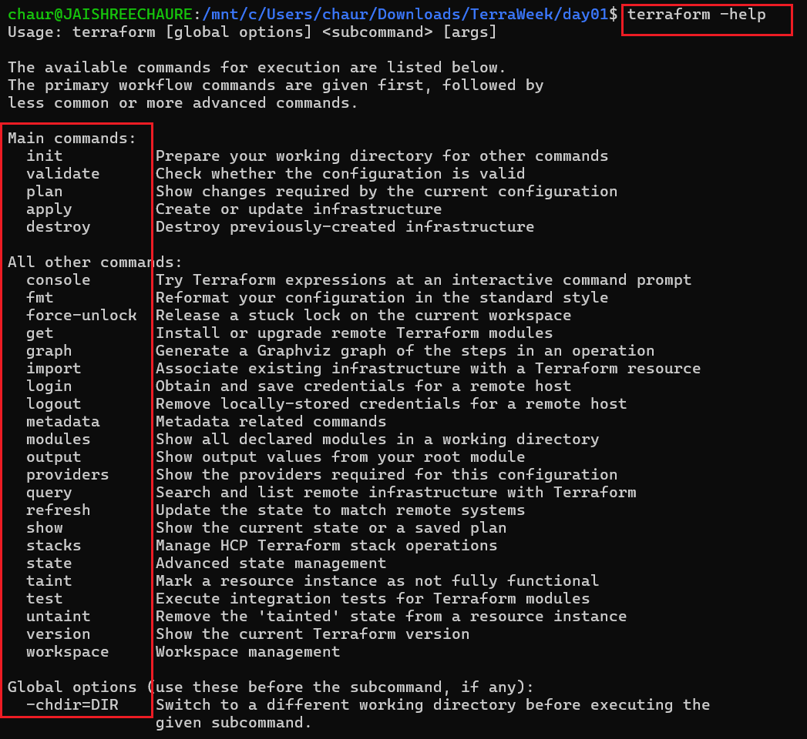

### VS Code Extension

Installed the **HashiCorp Terraform** extension in VS Code for:

- Syntax highlighting
- Auto-completion
- HCL language support

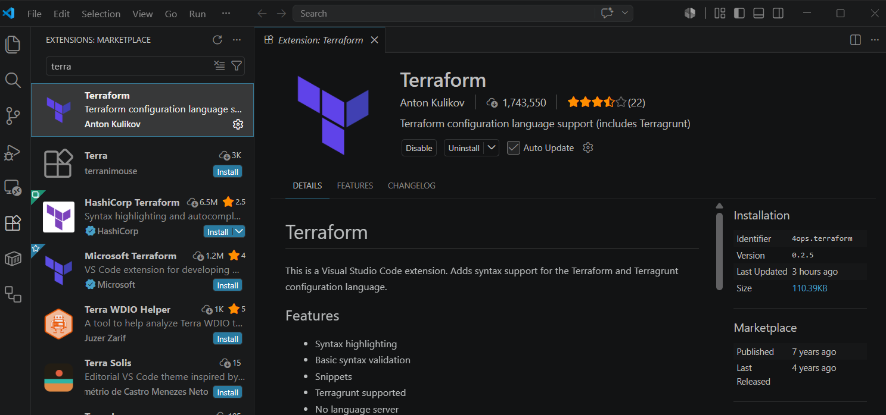

---

# Task 3: Learn 6 Crucial Terraform Terminologies

| Terminology | Description | Example |
|-------------|-------------|---------|
| **Provider** | A plugin that enables Terraform to communicate with cloud platforms and services. | AWS Provider, Azure Provider |
| **Resource** | An infrastructure object managed by Terraform. | EC2 Instance, S3 Bucket |
| **State** | A file that stores the current state of managed infrastructure. | `terraform.tfstate` |
| **Plan** | A preview of the changes Terraform will make before applying them. | `terraform plan` |
| **HCL** | HashiCorp Configuration Language used to write Terraform configuration files. | `main.tf` |
| **Module** | A reusable collection of Terraform configuration files. | VPC Module, EC2 Module |

### Further Reading

For detailed explanations, examples, and best practices, refer to my DevOps Notes:

- **Terraform Introduction & Workflow**  
  https://github.com/Jaishree97/DevOps-Notes/blob/main/Terraform/01-terraform-intro.md

---

# Task 4: Your First Terraform Configuration

Used the starter project in the **`example/`** directory to learn the complete Terraform workflow using the **Local** and **Random** providers. No cloud account or credentials were required.

### Terraform Workflow

| Step | Command | Result |
|------|---------|--------|
| 1 | `terraform init` | Initialized the working directory and downloaded required providers. |
| 2 | `terraform fmt` | Formatted the Terraform configuration files. |
| 3 | `terraform validate` | Verified that the configuration is valid. |
| 4 | `terraform plan` | Previewed the infrastructure changes before deployment. |
| 5 | `terraform apply` | Created the local file and generated a random pet name. |
| 6 | `cat greeting.txt` | Verified the file created by Terraform. |
| 7 | `terraform output` | Displayed the output values defined in the configuration. |
| 8 | `terraform destroy` | Deleted all resources created during the lab. |

#### 1️⃣ Initialize Terraform

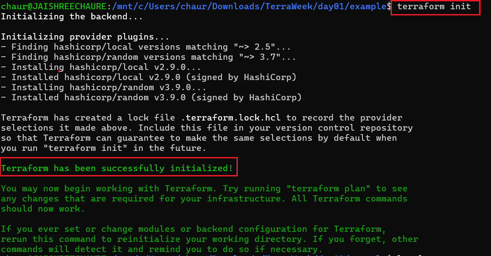

---

#### 2️⃣ Format & Validate Configuration

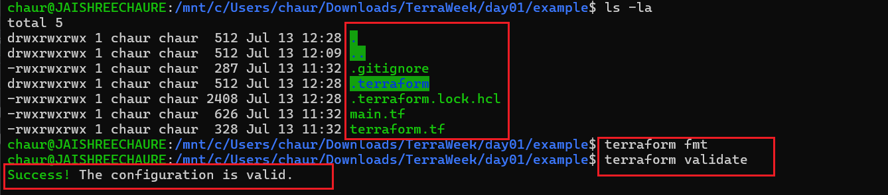

---

#### 3️⃣ Preview Infrastructure Changes

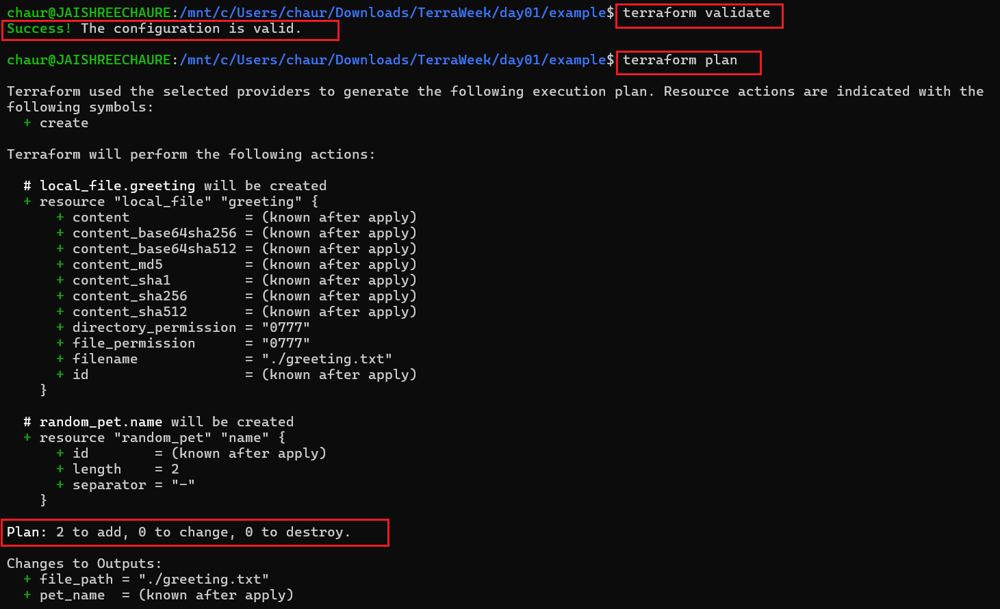

---

#### 4️⃣ Apply Configuration

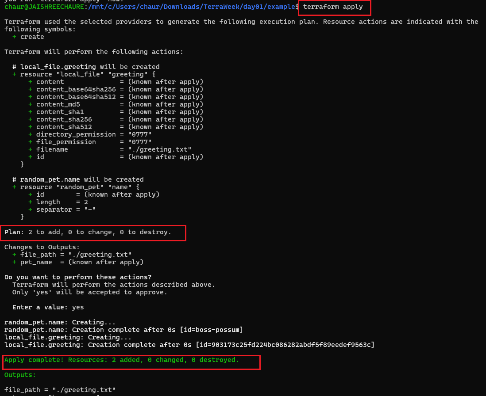

---

#### 5️⃣ Verify Generated Output & Destroy Resources

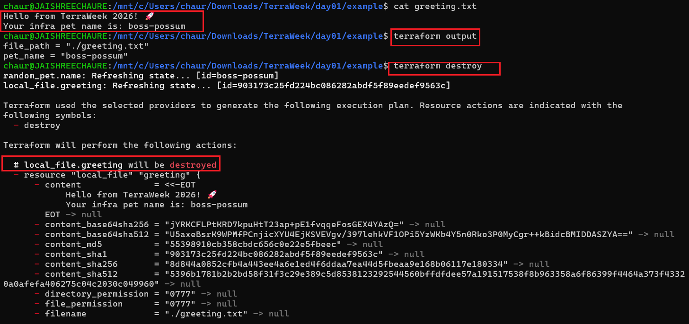

---

### Learning Outcome

- Understood the complete Terraform workflow.
- Initialized Terraform providers.
- Formatted and validated Terraform configuration.
- Previewed infrastructure changes safely using `terraform plan`.
- Created resources using `terraform apply`.
- Verified generated outputs.
- Cleaned up resources using `terraform destroy`.

---

# Bonus (Brownie Points)

Completed the optional bonus tasks to explore additional Terraform and OpenTofu features.

### Bonus Tasks

| Task | Status | Summary |
|------|:------:|---------|
| Terraform CLI Autocomplete | ✅ | Verified tab completion was already configured. |
| OpenTofu | ✅ | Installed OpenTofu and executed the same Terraform workflow successfully. |
| `.terraform.lock.hcl` | ✅ | Explored the dependency lock file created during initialization. |

---

### Bonus Outputs

#### 1️⃣ Terraform CLI Autocomplete

```bash
terraform -install-autocomplete
```

> Tab completion was already configured in `~/.bashrc`.

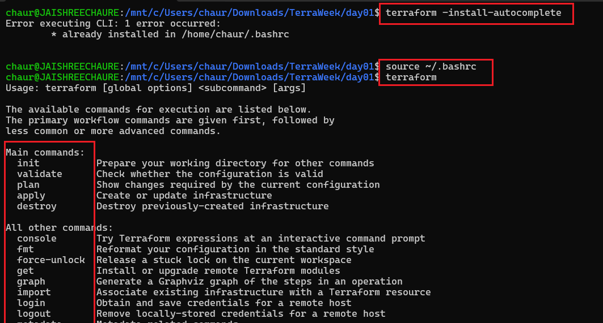

---

#### 2️⃣ OpenTofu

Installed **OpenTofu** using Snap and verified the installation.

```bash
sudo snap install opentofu --classic

tofu version
```

Executed the same Terraform workflow using OpenTofu:

```bash
tofu init
tofu plan
tofu apply
tofu destroy
```
> OpenTofu is an open-source fork of Terraform and uses the `tofu` command instead of `terraform`.

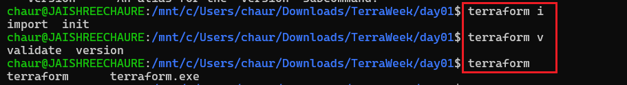

---

#### 3️⃣ .terraform.lock.hcl

The `.terraform.lock.hcl` file locks provider versions and stores checksums, ensuring consistent and reproducible Terraform deployments.

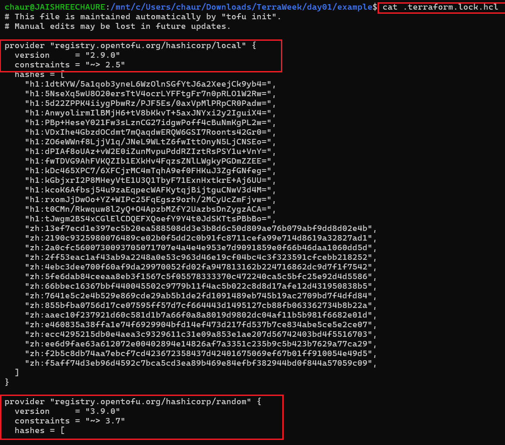
<<<<<<< HEAD

=======
>>>>>>> e97772b (added day01 documentation)
---


