# 🌱 TerraWeek Day 2 – HCL Deep Dive: Variables, Types & Expressions

**Date:** Monday, 13th July 2026

## Learning Summary

Today I explored **HashiCorp Configuration Language (HCL)** in depth by learning blocks, arguments, expressions, variables, validation, locals, outputs, Terraform functions, and variable precedence. I also built a Terraform project using the Docker provider and practiced passing variables using both `-var` and `terraform.tfvars`.

---

## Table of Contents

- [Project Structure](#project-structure)
- [Task 1: Master HCL Syntax](#task-1-master-hcl-syntax)
- [Task 2: Variables, Types & Validation](#task-2-variables-types--validation)
- [Task 3: Locals, Outputs & Functions](#task-3-locals-outputs--functions)
- [Task 4: Build a Terraform Project](#task-4-build-a-terraform-project)
- [Difference Between `-var` and `terraform.tfvars`](#difference-between--var-and-terraformtfvars)
- [Variable Precedence](#variable-precedence)
- [Bonus](#bonus)
- [Final Verification](#final-verification)
- [Learning Outcome](#learning-outcome)

---

## Project Structure

```text
day02/
├── README.md
├── day02.md
├── example/
│   ├── main.tf
│   ├── variables.tf
│   ├── outputs.tf
│   ├── terraform.tfvars
│   └── terraform.tfvars.example
└── images/
```

## Task 1: Master HCL Syntax

Learned the core building blocks of Terraform configuration using **HCL (HashiCorp Configuration Language)**.

### HCL Block Structure

```hcl
block_type "label_one" "label_two" {
  argument = value
}
```

#### Example

```hcl
resource "docker_container" "web" {
  name  = "nginx-container"
  image = "nginx:latest"
}
```

| Component | Description |
|-----------|-------------|
| Block | Defines an infrastructure object |
| Argument | Configures the block using `key = value` |
| Expression | Calculates or references values |

> 📖 **Read More**  
> **DevOps Notes →** [Terraform Functions & Expressions](https://github.com/Jaishree97/DevOps-Notes/blob/main/Terraform/13-functions-and-expressions.md)

---

## Task 2: Variables, Types & Validation

Created a reusable **`variables.tf`** file covering all major Terraform variable types and validation rules.

### Variable Types

| Category | Types |
|----------|-------|
| Primitive | `string`, `number`, `bool` |
| Collection | `list`, `map`, `set` |
| Structural | `object`, `tuple` |

### Features Implemented

- Default values
- Variable validation
- Sensitive variables

> 📖 **Read More**  
> **DevOps Notes →** [Terraform Variables](https://github.com/Jaishree97/DevOps-Notes/blob/main/Terraform/05-variables.md)

### Project Files

- [`variables.tf`](./example/variables.tf)
- [`terraform.tfvars`](./example/terraform.tfvars)
- [`terraform.tfvars.example`](./example/terraform.tfvars.example)

### Output

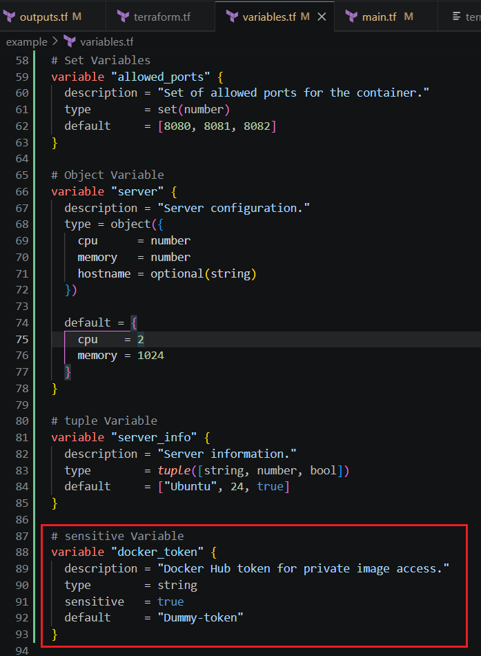

---

## Task 3: Locals, Outputs & Functions

Implemented reusable **locals**, displayed resource information using **outputs**, and explored Terraform built-in functions with **terraform console**.

### Functions Practiced

- `upper()`
- `merge()`
- `join()`

> 📖 **Read More**

- **DevOps Notes →** [Terraform Locals & Data Sources](https://github.com/Jaishree97/DevOps-Notes/blob/main/Terraform/08-locals-and-data-sources.md)
- **DevOps Notes →** [Terraform Outputs](https://github.com/Jaishree97/DevOps-Notes/blob/main/Terraform/06-outputs.md)
- **DevOps Notes →** [Terraform Functions & Expressions](https://github.com/Jaishree97/DevOps-Notes/blob/main/Terraform/13-functions-and-expressions.md)

### Project Files

- [`main.tf`](./example/main.tf)
- [`outputs.tf`](./example/outputs.tf)

### Results

#### Locals

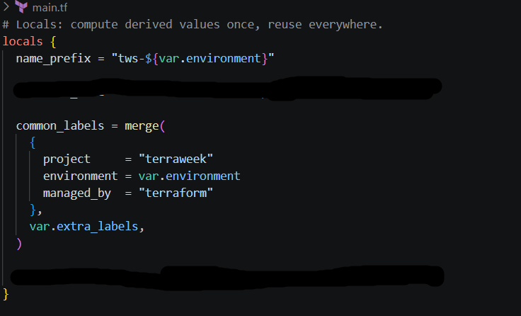

#### Outputs

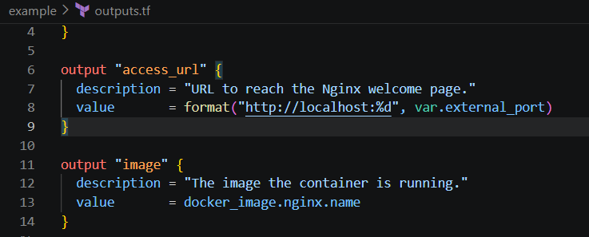

#### Terraform Console

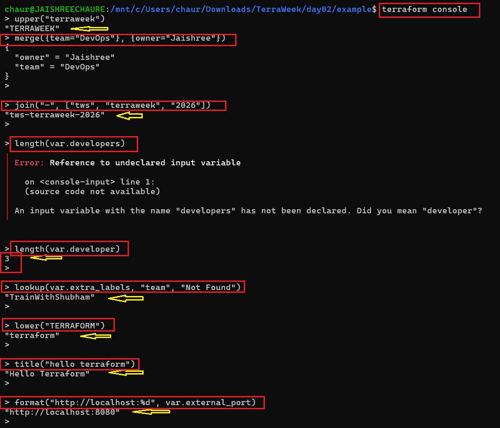

---
## Architecture

The following diagram illustrates how Terraform communicates with the Docker provider to provision and manage an Nginx container.

```text
Terraform CLI
      │
      ▼
Terraform Configuration
      │
      ▼
Docker Provider
      │
      ▼
Docker Engine
      │
      ▼
Nginx Container
      │
      ▼
http://localhost:8080
```

---            

## Task 4: Build a Terraform Project

Built an **Nginx Docker container** using the Terraform Docker provider and completed the full Terraform workflow.

### Project Files

- [`main.tf`](./example/main.tf)
- [`variables.tf`](./example/variables.tf)
- [`outputs.tf`](./example/outputs.tf)
- [`terraform.tfvars`](./example/terraform.tfvars)

> **Read More**

- **DevOps Notes →** [Terraform Providers](https://github.com/Jaishree97/DevOps-Notes/blob/main/Terraform/03-providers.md)
- **DevOps Notes →** [Terraform Resources](https://github.com/Jaishree97/DevOps-Notes/blob/main/Terraform/04-resources.md)

### Terraform Workflow

| Step | Description |
|------|-------------|
| `terraform init` | Initialize providers |
| `terraform plan` | Preview changes |
| `terraform apply` | Create resources |
| `terraform output` | View outputs |
| `terraform destroy` | Remove resources |

### Workflow Output

#### Initialize

Initialized the working directory and downloaded the required Docker provider.

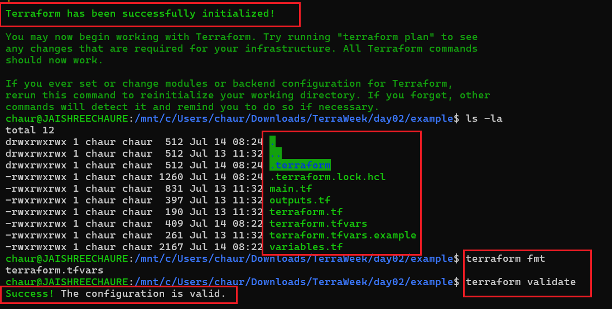

#### Plan

Generated an execution plan to preview the infrastructure changes before applying them.

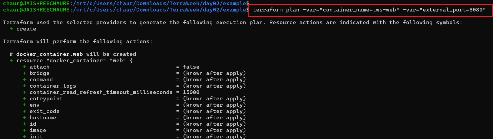

#### Apply

Executed `terraform apply` to create the Nginx Docker container. Terraform pulled the required image and provisioned the container successfully.

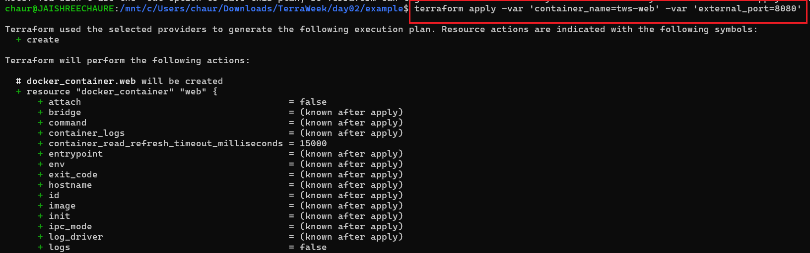

#### Browser Output

Verified that the Nginx container was running successfully by opening the application in the browser.

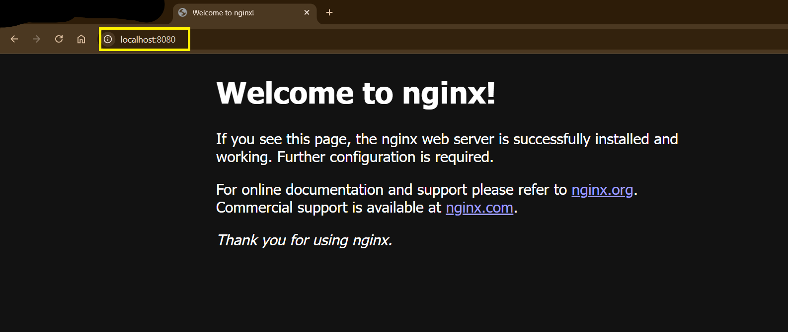

#### Output

Displayed the Terraform outputs, including the container name, image details, and access URL after successful deployment.

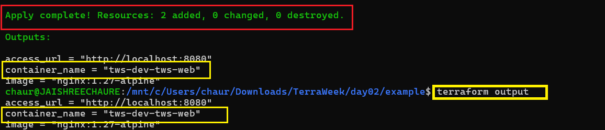

#### Destroy

Removed all Terraform-managed Docker resources to clean up the environment.

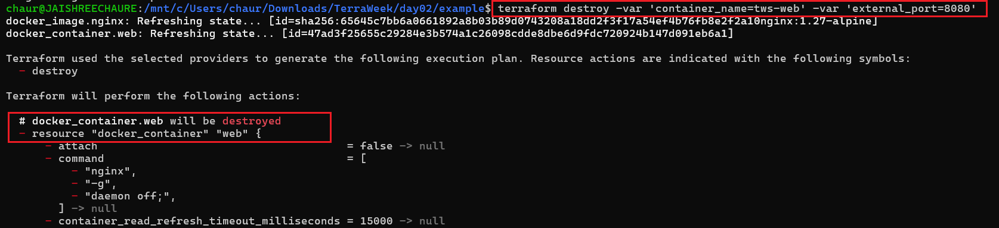

#### Using `terraform.tfvars`

Executed Terraform commands without using the `-var` flag. Terraform automatically loaded the values from `terraform.tfvars`, making the workflow cleaner and more reusable.

##### Plan

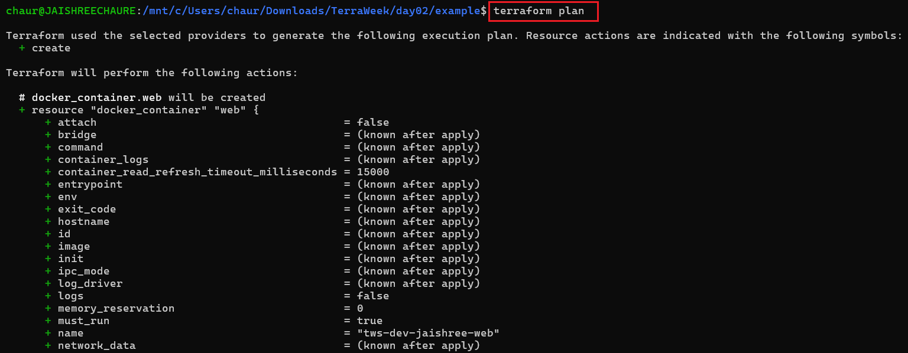

##### Apply

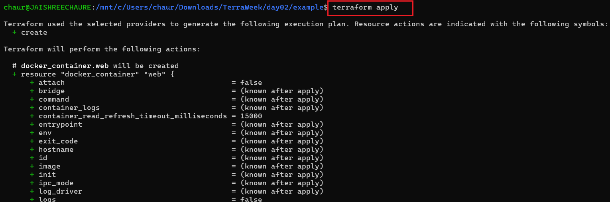

##### Destroy

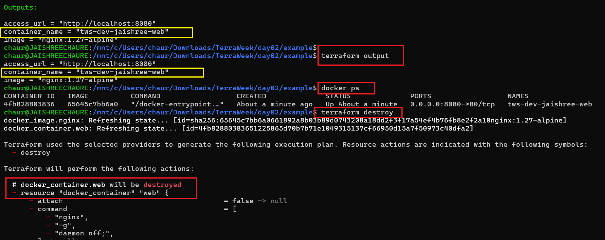

---

## Difference Between `-var` and `terraform.tfvars`

| `-var` | `terraform.tfvars` |
|--------|---------------------|
| Passes variables through the command line | Stores variables in a file |
| Good for testing or CI/CD | Best for reusable projects |
| Must be supplied every run | Loaded automatically |

---

## Variable Precedence

Terraform follows a specific order when resolving variable values. If the same variable is defined in multiple places, the value from the highest-precedence source is used.

```text
-var / -var-file
      ↓
*.auto.tfvars
      ↓
terraform.tfvars
      ↓
TF_VAR_*
      ↓
default
```

---

## Bonus

Completed additional HCL exercises to strengthen my understanding of Terraform expressions and optional object attributes.

| Feature | Status |
|---------|:------:|
| For Expression | ✅ |
| Conditional Expression | ✅ |
| Optional Attributes | ✅ |

### Results

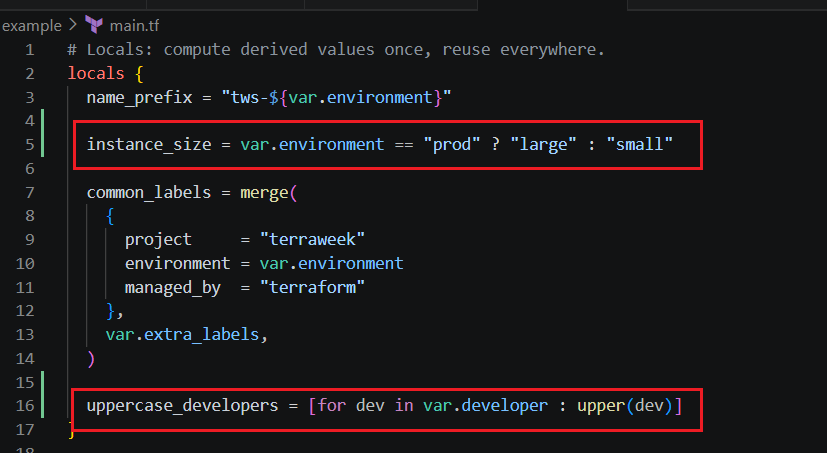

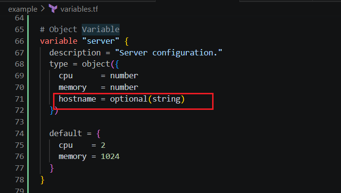

---

## Final Verification

Validated and formatted the Terraform configuration to ensure it was syntactically correct and ready for deployment.

```bash
terraform fmt
terraform validate
terraform plan
terraform apply
```

### Final Output

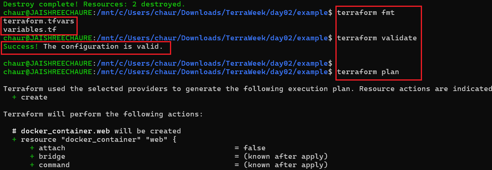

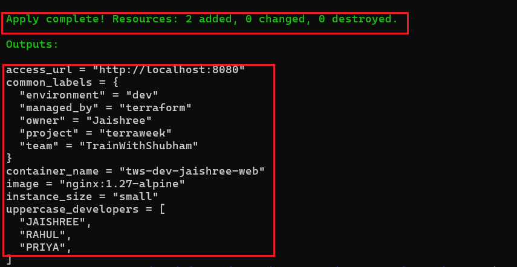

---

## Learning Outcome

By completing Day 2, I can now:

- Build reusable Terraform configurations using HCL.
- Define variables with validation and appropriate data types.
- Use locals to reduce duplicate configuration values.
- Display resource information using outputs.
- Evaluate expressions with Terraform Console.
- Understand Terraform variable precedence.
- Provision and destroy Docker resources using Terraform.
- Follow the complete Terraform workflow from `init` to `destroy`.

---

## 🎯 Conclusion

Day 2 strengthened my understanding of HCL and Terraform fundamentals. By combining theory with hands-on practice, I learned how to write reusable Terraform configurations, manage variables effectively, and automate Docker infrastructure using Terraform.