# ☁️ TerraWeek Day 3 — Providers, Resources & Your First Cloud Infra

**Date:** 14th July 2026

## 📌 Overview

On Day 3, I learned how Terraform interacts with AWS using providers and data sources while provisioning a complete AWS infrastructure stack. I explored Terraform meta arguments, lifecycle rules, resource dependencies, and automated EC2 bootstrapping using user data.

This hands-on project provisions AWS infrastructure using Terraform and demonstrates both mandatory and bonus Terraform concepts.

---

## 📚 Table of Contents

- [Learning Goals](#-learning-goals)
- [Prerequisites](#-prerequisites)
- [Estimated Cost](#-estimated-cost)
- [How to Run](#️-how-to-run)
- [Setup Authentication](#️-setup-authenticate-your-cloud)
- [Architecture Diagram](#️-architecture-diagram)
- [Infrastructure Summary](#️-infrastructure-summary)
- [Project Structure](#-project-structure)
- [Networking Primer](#️-networking-primer)
- [Tasks](#-tasks)
- [Terraform Outputs](#-terraform-outputs)
- [Terraform State](#-terraform-state)
- [Bonus](#-bonus)
- [Challenges Faced](#-challenges-faced)
- [moved Block](#-moved-block)
- [Key Takeaways](#-key-takeaways)

---

## 🎯 Learning Goals

- Configure Terraform providers and version constraints.
- Understand resources and data sources.
- Use Terraform meta-arguments effectively.
- Provision and manage AWS infrastructure safely.

---

## ✅ Prerequisites

Before running this project, make sure you have:

| Requirement | Version |
|------------|------------|
| Terraform | v1.13.x or later |
| AWS CLI | Installed and configured |
| AWS Account | Active account with Free Tier access |
| IAM User | Programmatic access enabled |
| Git | Installed |
| Graphviz | For terraform graph visualization |

---

## Estimated Cost

This project is designed to use Free Tier eligible resources.

Resources used:

- t3.micro EC2 Instances
- Elastic IP
- VPC
- Security Group
- Internet Gateway
- Route Table

> Note: Elastic IPs may incur charges if they are not attached to a running instance.

Always destroy the infrastructure after completing the lab.

---

## How to Run

- `git clone <repository-url>`
- `cd day03/example`
- `terraform fmt`
- `terraform init`
- `terraform validate`
- `terraform plan -out=tfplan`
- `terraform apply tfplan`
- `terraform output`
- `terraform destroy`

---

## Setup: Authenticate Your Cloud

- Pick **one** provider and configure its CLI (never hard-code credentials in `.tf` files!):

I chose **AWS** for this challenge.

```bash
aws configure
```

Terraform uses the credentials stored in `~/.aws/credentials`, so never hard-code them in your `.tf` files.

> **Note:** If you're using Azure, GCP, or Utho, check the official TerraWeek repository for the authentication steps and provider configuration. 
> - https://github.com/LondheShubham153/TerraWeek

> **Need Help?**
>
> Check the complete installation and AWS CLI setup guide here:
> - [Terraform Installation & AWS Authentication](https://github.com/Jaishree97/DevOps-Notes/blob/main/Terraform/02-terraform-installation-setup.md)

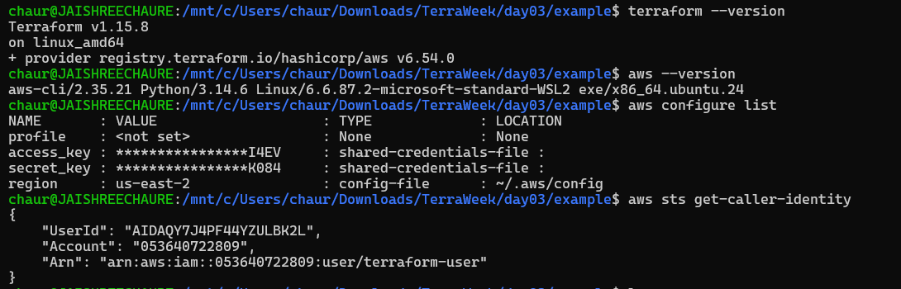

## Notes

- Region used: us-east-1
- Provider Alias region: ap-south-1
- Free Tier instance type used: t3.micro
- Security Group allows ports 22, 80 and 443.
- Nginx is installed automatically using user_data.
- Infrastructure is provisioned entirely using Terraform.

## Architecture Diagram

```text
                    Internet
                        |
                 Internet Gateway
                        |
                   Route Table
                        |
                    Public Subnet
                        |
                        VPC
                        |
                 Security Group
                        |
               --------------------
               |                  |
            EC2-1              EC2-2
          (Nginx)             (Nginx)
               |
           Elastic IP
               |
            Browser
```

## Infrastructure Summary

| Resource | Value |
|---------|---------|
| Cloud Provider | AWS |
| Region | `us-east-1` |
| Provider Alias | `ap-south-1` |
| AMI | Amazon Linux 2023 |
| Instance Type | `t3.micro` |
| EC2 Instances | 2 |
| Elastic IP | 1 |
| Web Server | Nginx |
| Terraform | `v1.15.8` |
| AWS Provider | `~> 6.0` |

---

## Project Structure

```text
day03/
├── README.md
├── day03.md
├── example/
│   ├── terraform.tf
│   ├── main.tf
│   ├── variables.tf
│   └── outputs.tf
└── images/
```
---

## Networking Primer

| Resource | Purpose |
|---------|---------|
| **VPC** | Your own private network in AWS. |
| **Public Subnet** | A part of the VPC that can access the internet. |
| **Internet Gateway** | Connects your VPC to the internet. |
| **Route Table** | Controls where network traffic goes. |
| **Route Table Association** | Links the subnet with the route table. |
| **Security Group** | Acts as a firewall for your resources. |
| **EC2 Instance** | Your virtual machine (web server). |
| **Elastic IP** | A static public IP address for your EC2 instance. |

## Tasks

### Task 1: Providers & Version Pinning

- Added the `terraform` block with `required_version` and `required_providers`.
- Used version pinning (`~>`) to ensure compatibility and predictable deployments.
- Configured a second AWS provider alias for a different region.

> 📄 **Code:** [`terraform.tf`](./example/terraform.tf)

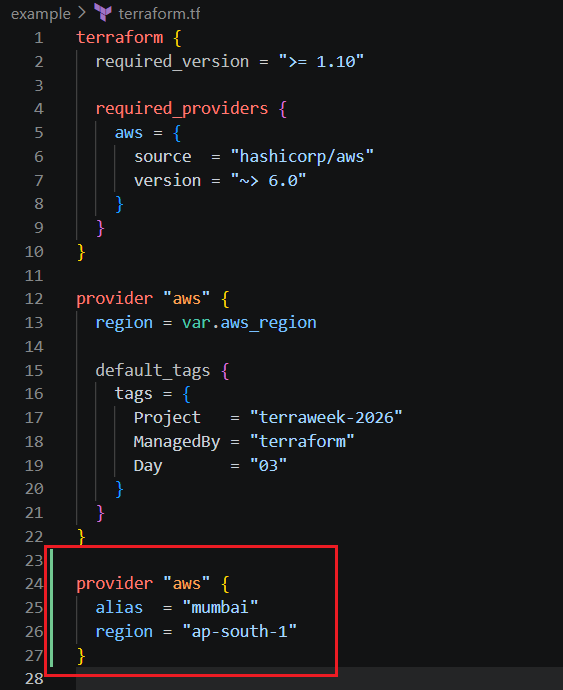

### Task 2: Resources vs Data Sources

- Created Terraform resources to provision AWS infrastructure.
- Used Terraform data sources to retrieve existing AWS information.
- **Resources** create and manage infrastructure, while **data sources** only read existing infrastructure.

> 📄 **Code:** [`main.tf`](./example/main.tf)

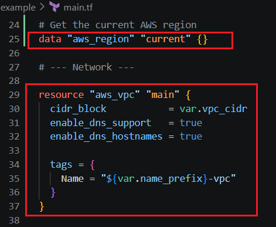

### Task 3: Provision a Cloud Stack

Built a minimal AWS infrastructure using Terraform, including:

- VPC and Public Subnet
- Internet Gateway and Route Table
- Security Group
- Two EC2 instances using count
- Amazon Linux 2023 AMI (retrieved dynamically using a data source)

> 📄 **Code:** [`main.tf`](./example/main.tf)

### Terraform Workflow

The following Terraform commands were used during infrastructure provisioning and verification.

```bash
terraform fmt
terraform init
terraform validate
terraform plan -out=tfplan
terraform apply tfplan
terraform output
terraform state list
```

| Command | Screenshot |
|--------|--------|
| `terraform init` | 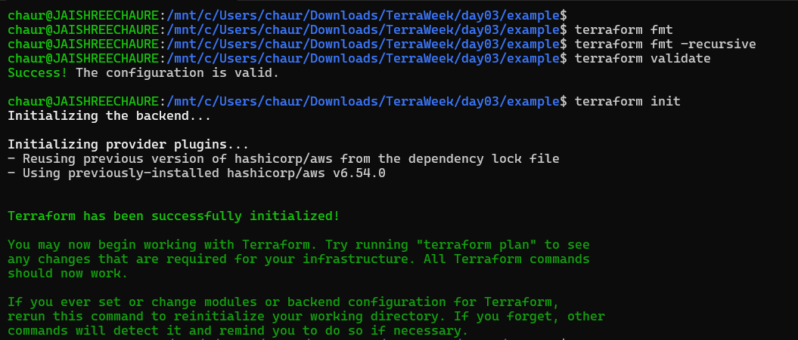 |
| `terraform validate` | 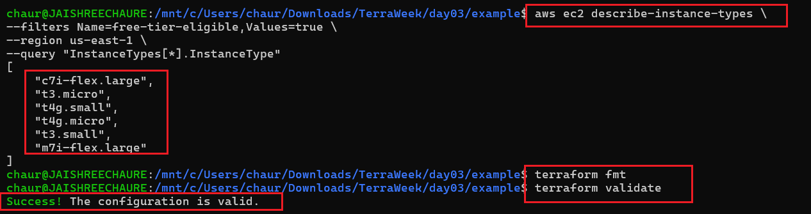 |
| `terraform plan` | 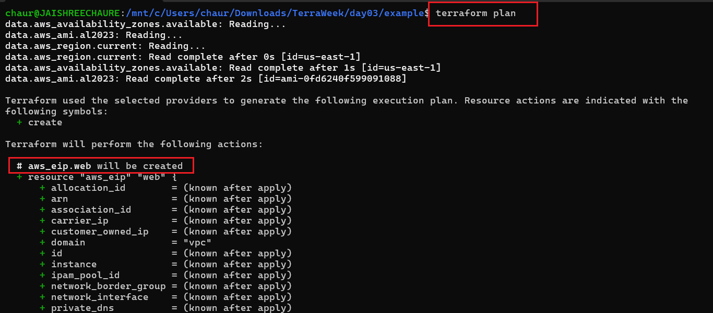 |
| `terraform apply` | 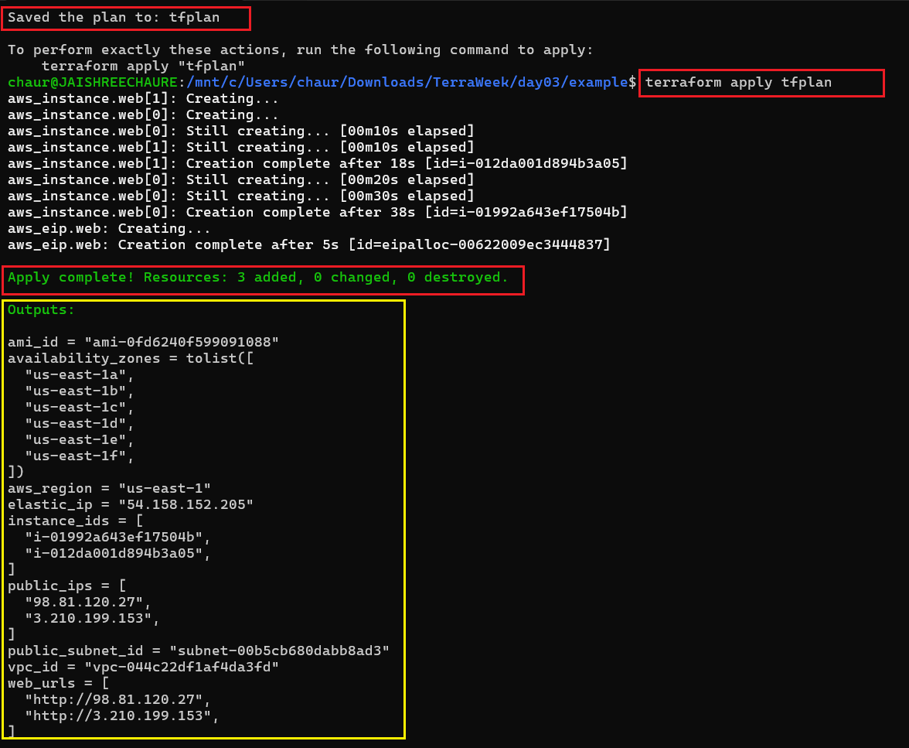 |
| `terraform output` |  |
| `terraform state list` | 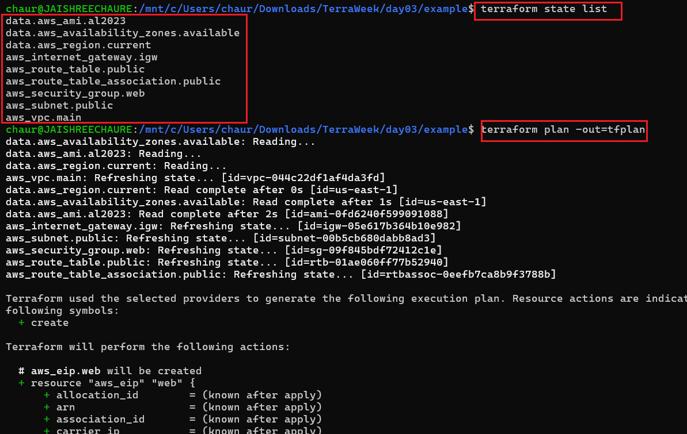 |

### Troubleshooting During Provisioning

While provisioning the infrastructure, Terraform failed because the selected EC2 instance type was not Free Tier eligible.

#### Apply Error (Invalid Instance Type)

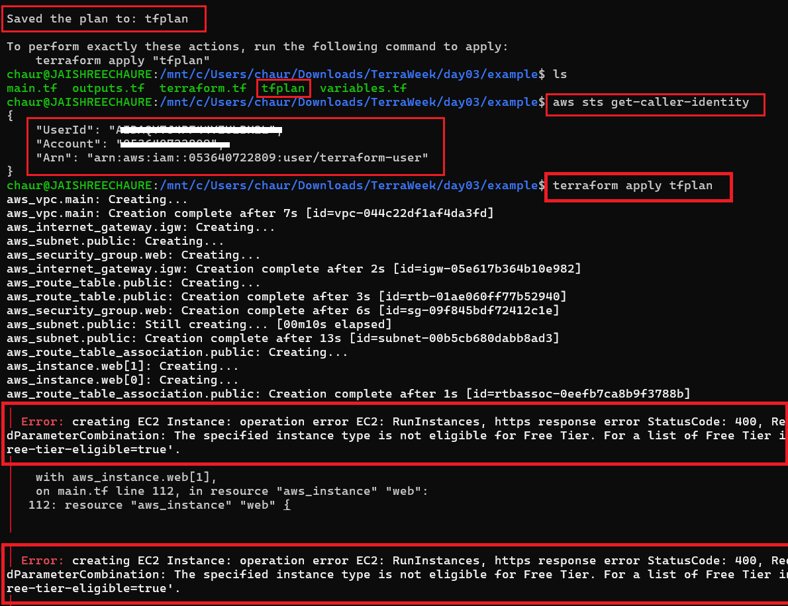

The issue was resolved by changing the instance type from `t2.micro` to `t3.micro`.

## Terraform Outputs

The following outputs are displayed after provisioning the infrastructure:

| Output | Description |
|--------|--------|
| AMI ID | Amazon Linux 2023 AMI used |
| Instance IDs | EC2 instance identifiers |
| Public IPs | Public IP addresses of the instances |
| Web URLs | URLs to access the Nginx web server |
| Elastic IP | Static public IP attached to the instance |
| VPC ID | Created VPC identifier |
| Public Subnet ID | Created public subnet identifier |
| Availability Zones | AWS Availability Zones used |

```bash
terraform output
```

#### Terraform Apply & Outputs


## Terraform State

Terraform tracks the current state of your infrastructure.

| Command | Purpose |
|--------|--------|
| `terraform state list` | Lists all resources managed by Terraform. |

```bash
terraform state list
```


#### EC2 Instance Running (AWS Console)

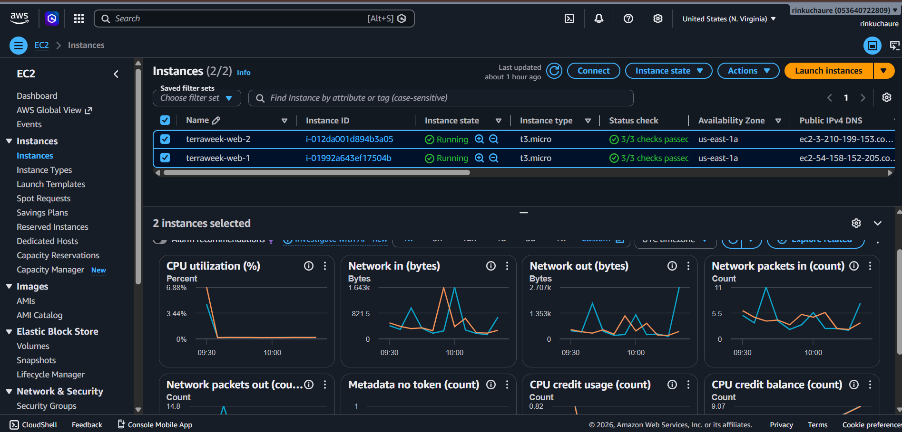


### Task 4: Meta-Arguments in Action

Implemented the following Terraform meta-arguments:

The following meta-arguments were implemented to control resource creation, dependencies, and lifecycle management.

| Meta-Argument | Purpose |
|--------------|---------|
| `count` | Create multiple identical resources. |
| `for_each` | Create resources from a map or set. |
| `depends_on` | Define explicit resource dependencies. |
| `lifecycle` | Control resource creation, updates, and deletion. |

> 📄 **Code:** [`main.tf`](./example/main.tf)

### Task 5: Update Infrastructure & Destroy Resources

- Updated the Terraform configuration and reviewed the execution plan.
- Observed in-place updates vs resource replacement.
- Destroyed all resources to avoid unnecessary charges.

> 📄 **Code:** [`main.tf`](./example/main.tf) | [`outputs.tf`](./example/outputs.tf)

#### Cleanup

```bash
terraform destroy
```

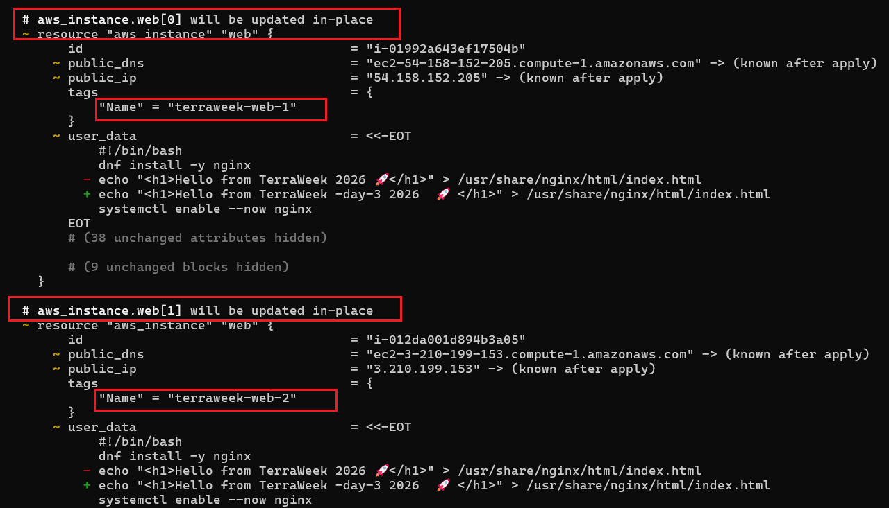

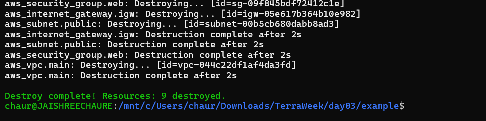

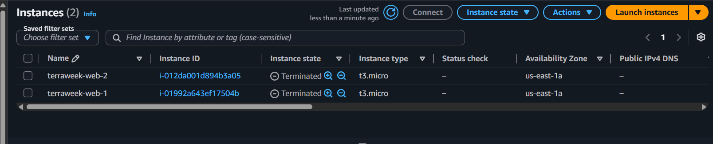

## `count` vs `for_each`

| Meta-Argument | Best Used For |
|--------------|--------------|
| `count` | Multiple identical resources. |
| `for_each` | Resources with unique names or configurations. |

## Bonus

Implemented the following bonus tasks:

- Attached an Elastic IP to EC2-1.
- Automated Nginx installation using user_data.
- Generated and visualized the Terraform dependency graph.
- Learned and documented Terraform's moved block.
- Verified infrastructure using Terraform outputs.

> 📄 Code: [`main.tf`](./example/main.tf) | [`outputs.tf`](./example/outputs.tf)

#### Elastic IP

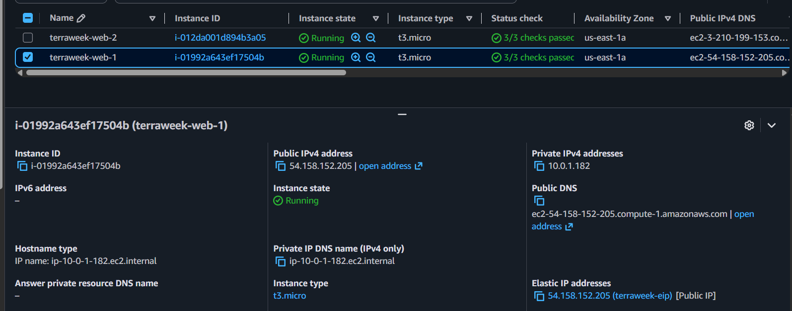

#### Second Instance

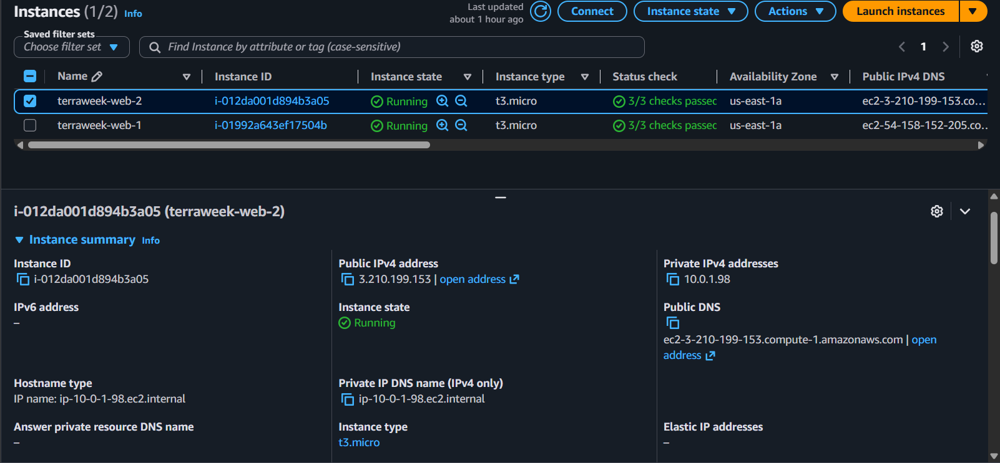

#### Browser Output

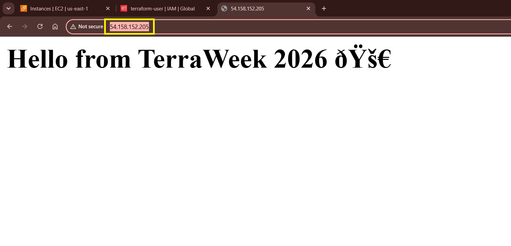

#### Bonus Task

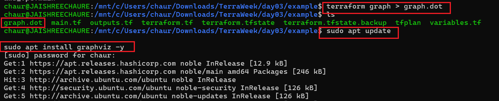

#### Terraform Graph Files

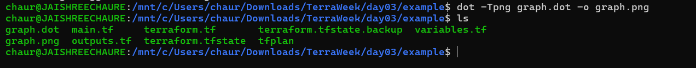

#### Generated Dependency Graph

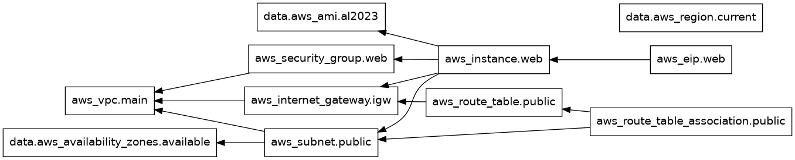

## Challenges Faced

| Issue | Resolution |
|------|------|
| `t2.micro` was not Free Tier eligible in `us-east-1`. | Updated the instance type to `t3.micro`. |

Verified the supported Free Tier instance types using:

```bash
aws ec2 describe-instance-types \
--filters Name=free-tier-eligible,Values=true \
--region us-east-1 \
--query "InstanceTypes[*].InstanceType"
```

## `moved` Block

The `moved` block lets you rename Terraform resources without destroying and recreating them.

```hcl
moved {
  from = aws_instance.web
  to   = aws_instance.nginx_server
}
```

**Common use cases:**

- Rename resources safely.
- Refactor Terraform code.
- Migrate Terraform state.
- Avoid unnecessary resource recreation.

## Key Takeaways

- Terraform Providers and Version Pinning
- Data Sources vs Resources
- AWS Infrastructure Provisioning
- count and for_each Meta Arguments
- Resource Dependencies using depends_on
- Lifecycle Rules
- Elastic IP Management
- EC2 Bootstrapping with user_data
- Terraform Outputs and State
- Terraform Graph Visualization
- Infrastructure Updates and Cleanup
- Real-World Terraform Troubleshooting