# 🗄️ TerraWeek Day 4 — Terraform State & Remote Backends (Native Locking)

**Date:** Wednesday, 15th July 2026

## 📌 Overview

On Day 4, I learned how Terraform tracks infrastructure using state files and how to securely manage state in collaborative environments using remote backends. I explored Terraform state commands, configured an S3 backend with native state locking, imported existing resources into Terraform, and implemented modern Terraform features such as moved, removed, and check blocks.

This hands-on project demonstrates both the mandatory and bonus Terraform concepts introduced in TerraWeek Day 4.

---

## Table of Contents

- [Learning Goals](#-learning-goals)
- [What's New in Terraform State Locking](#-what-changed-important)
- [Estimated Cost](#-estimated-cost)
- [How to Run](#-how-to-run)
- [Architecture Diagram](#️-architecture-diagram)
- [Project Structure](#-project-structure)
- [Task 1: Why Terraform State Matters](#task-1-why-terraform-state-matters)
- [Task 2: Explore Local State & `terraform state`](#task-2-explore-local-state--terraform-state)
- [Task 3: Bootstrap the Backend Infrastructure](#task-3-bootstrap-the-backend-infrastructure)
- [Task 4: Configure an S3 Remote Backend](#task-4-configure-an-s3-remote-backend)
- [Task 5: Import an Existing Resource](#task-5-import-an-existing-resource)
- [Bonus Tasks](#bonus-tasks)
- [Cleanup](#cleanup)
- [Key Takeaways](#key-takeaways)

---

## Learning Goals

- Understand Terraform State and why it exists.
- Learn how Terraform tracks infrastructure.
- Explore Terraform State commands.
- Configure remote state using Amazon S3.
- Enable native S3 state locking.
- Understand Terraform's moved, removed, and check blocks.
- Follow Terraform state management best practices.
---

## 🆕 What Changed (Important!)

> The old TerraWeek taught **S3 + DynamoDB** for state locking.
> As of **Terraform 1.10** (experimental) and **1.11** (GA), the S3 backend supports **native locking** via a lock file in the bucket — using S3 conditional writes.
> **DynamoDB-based locking is now deprecated** and will be removed in a future release.
> ➡️ For all new work, use **`use_lockfile = true`** and skip DynamoDB entirely.

---

## Estimated Cost

This project uses the following AWS resources:

- S3 Bucket
- S3 Bucket Versioning
- S3 Encryption
- Remote State Backend
- Native State Locking

> Note: S3 costs are minimal, but resources should always be destroyed after completing the lab.

---

## How to Run

```bash
git clone <repository-url>

cd day04/backend_infra
terraform init
terraform apply

cd ../backend_demo
terraform init
terraform apply
```

For cleanup:

```bash
terraform destroy
```

## 🏗️ Architecture Diagram

```text
          backend_infra (Bootstrap)
                     |
                     v
              Creates S3 Bucket
                     |
                     v
------------------------------------------------

            backend_demo (Terraform)
                     |
                     v
            terraform init / apply
                     |
                     v
               Amazon S3 Backend
                     |
                     v
        +----------------------------+
        | terraform.tfstate          |
        | terraform.tfstate.tflock   |
        | Versioning Enabled         |
        | Encryption Enabled         |
        +----------------------------+
                     |
                     v
          Native State Locking
           (use_lockfile = true)
                     |
                     v
             Remote State Storage
```

---

## Project Structure

```text
day04/
├── backend_demo/
│   ├── terraform.tf
│   ├── resources.tf
│   ├── moved.tf
│   ├── removed.tf
│   └── check.tf
├── backend_infra/
│   ├── terraform.tf
│   ├── variables.tf
│   ├── resources.tf
│   └── outputs.tf
├── images/
├── day04.md
└── README.md
```
---

## Task 1: Why Terraform State Matters

Terraform uses a state file (`terraform.tfstate`) to track the real-world infrastructure it manages. It acts as Terraform's source of truth and enables Terraform to determine what needs to be created, updated, or destroyed.

### Key Concepts

| Concept | Description |
|--------|--------|
| Terraform State | Tracks the infrastructure managed by Terraform. |
| Stored Information | Resource IDs, metadata, outputs, and dependencies. |
| Manual Editing | Never edit the state file manually as it can corrupt infrastructure state. |
| GitHub Safety | Never commit `terraform.tfstate` to version control. |
| State Drift | Occurs when infrastructure changes outside Terraform. |
| Sensitive Data | May contain infrastructure details and sensitive outputs. |
| Best Practice | Store state securely and use remote backends for collaboration. |

> **Best Practice:** Always add `terraform.tfstate` to `.gitignore`.

### State Drift Example

```text
AWS Console (Delete EC2 Instance)
                ↓
Terraform State (Still Exists)
                ↓
     Terraform Detects Drift
```

### Local State vs Remote State

| Local State | Remote State |
|------------|------------|
| Stored locally | Stored in a shared backend (e.g., S3) |
| Best for learning and small projects | Recommended for teams and production |
| No state locking | Supports state locking |
| Limited collaboration | Supports team collaboration |
| Higher risk of accidental loss | More secure and reliable |

---

## Task 2: Explore Local State & `terraform state`

Terraform provides several state commands that help inspect, manage, and refactor infrastructure without directly modifying the state file.

### Commands Used

```bash
terraform state list
terraform state show <resource_address>
terraform state mv <src> <dest>
terraform state rm <resource_address>
terraform show
```

### Command Summary

| Command | Purpose |
|---------|---------|
| `terraform state list` | Lists all resources currently managed by Terraform. |
| `terraform state show <resource_address>` | Displays detailed information about a specific resource. |
| `terraform state mv <src> <dest>` | Renames or moves a resource within the Terraform state. |
| `terraform state rm <resource_address>` | Removes a resource from Terraform state without deleting the infrastructure. |
| `terraform show` | Displays the current state in a human-readable format. |

> **Use Cases:** These commands are commonly used for debugging, refactoring Terraform configurations, inspecting managed resources, and safely managing Terraform state.


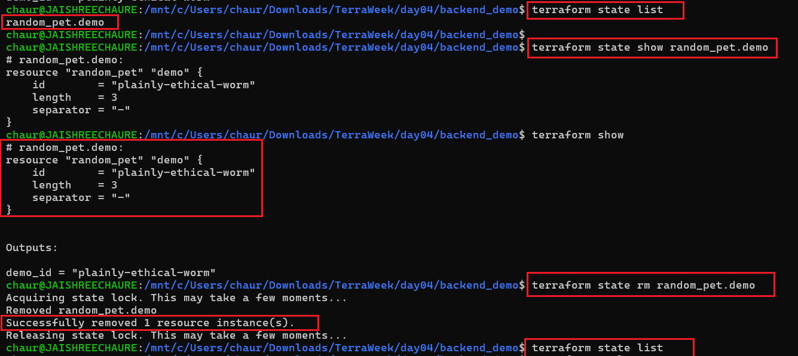

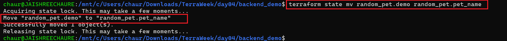

## Task 3: Bootstrap the Backend Infrastructure

Before configuring a remote backend, the S3 bucket that stores the Terraform state must already exist. This bootstrap step uses local state to provision the backend infrastructure.

```bash
cd backend_infra
terraform init
terraform apply
```

> 📄 **Code:** [`variables.tf`](./backend_infra/variables.tf)

---

### Terraform Init

Initialized the Terraform working directory and downloaded the required providers.

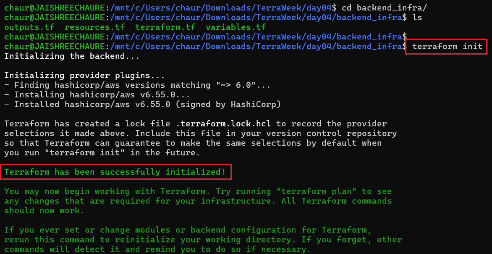

---

### Terraform Plan

Reviewed the execution plan before provisioning the backend infrastructure.

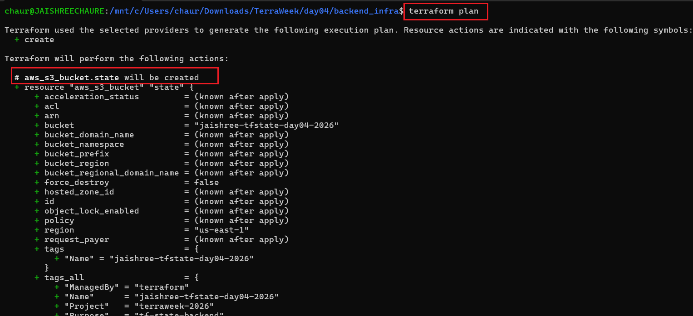

---

### Terraform Apply

Provisioned the S3 bucket and its associated backend configuration resources.

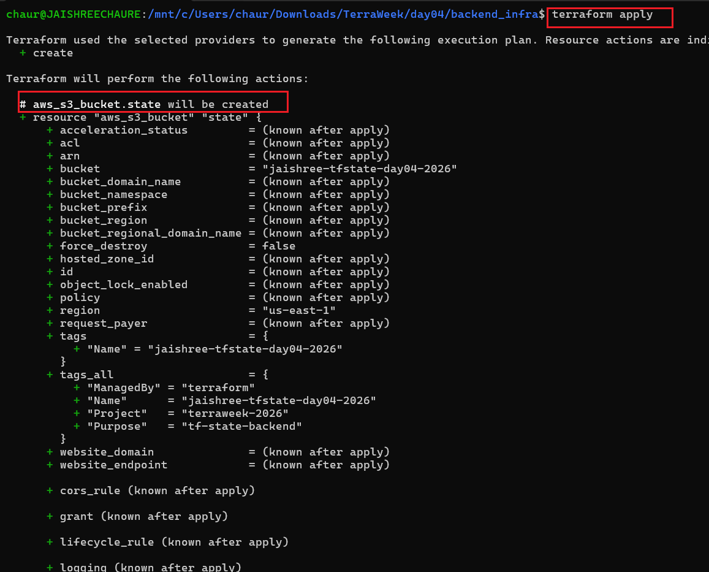

---

### Apply Successful

Terraform successfully created the backend infrastructure.

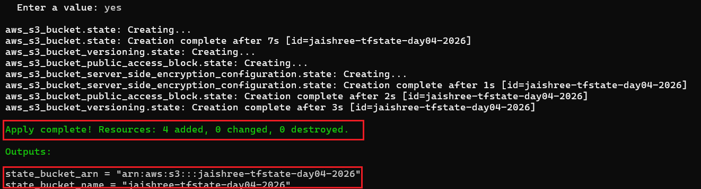

---

### Terraform Outputs

Verified the generated outputs for the backend infrastructure.

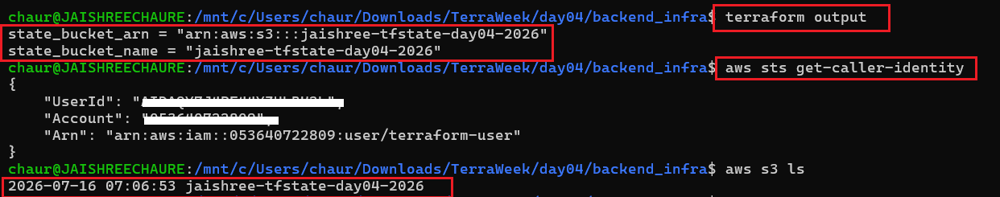

---

## Task 4: Configure an S3 Remote Backend

Configured Terraform to use an S3 remote backend with native state locking using `use_lockfile = true`.

### What Was Implemented

- Remote state storage using Amazon S3.
- Native state locking using `use_lockfile`.
- Local state migration to the S3 backend.
- State file and lock file verification.
- S3 bucket versioning for state recovery.

```hcl
terraform {
  backend "s3" {
    bucket       = "your-state-bucket"
    key          = "day04/terraform.tfstate"
    region       = "us-east-1"
    encrypt      = true
    use_lockfile = true
  }
}
```

```bash
terraform init
terraform apply
```

---

### Backend Configuration

Configured the Terraform backend for remote state management.

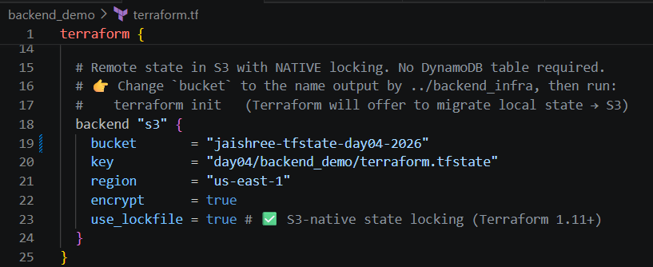

---

### Terraform Init

Migrated the local Terraform state to the S3 remote backend.

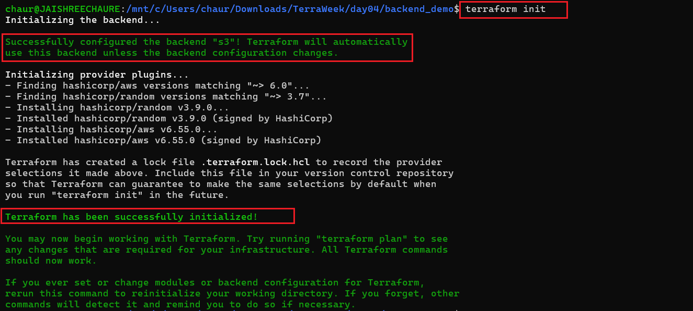

---

### Terraform Plan

Reviewed the planned changes before provisioning the resources.

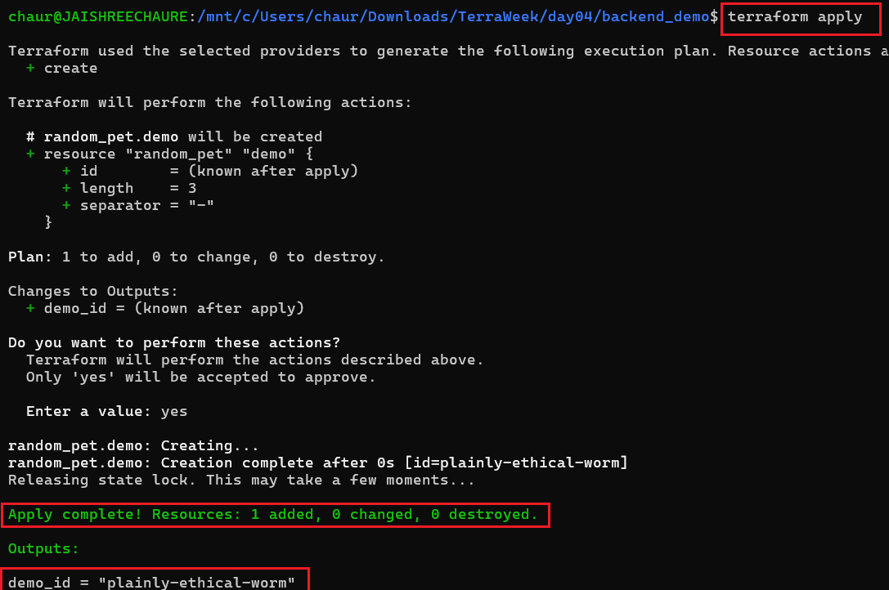

---

### Terraform Apply

Applied the Terraform configuration and stored the state file remotely.

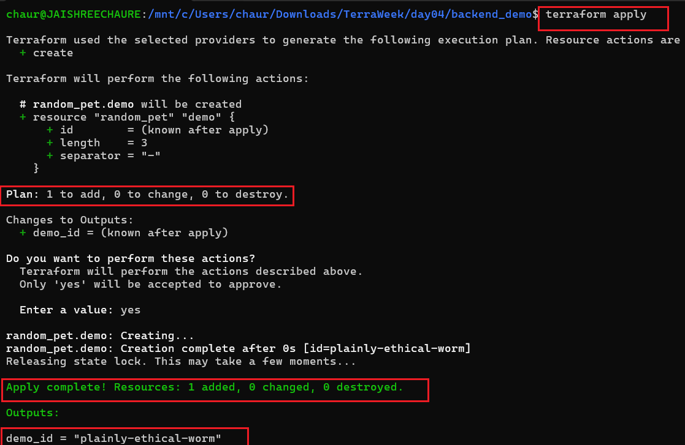

---

### Native State Locking

Verified native state locking during Terraform operations.

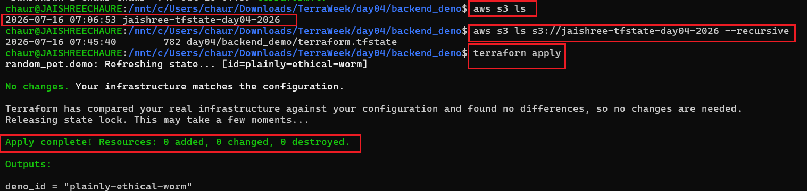

---

### S3 State Bucket

Verified the Terraform state bucket in the AWS Management Console.

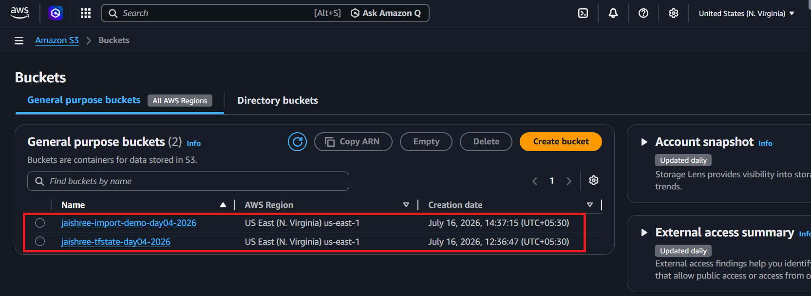

---

### Terraform State File

Confirmed that the Terraform state file is stored in the S3 bucket.

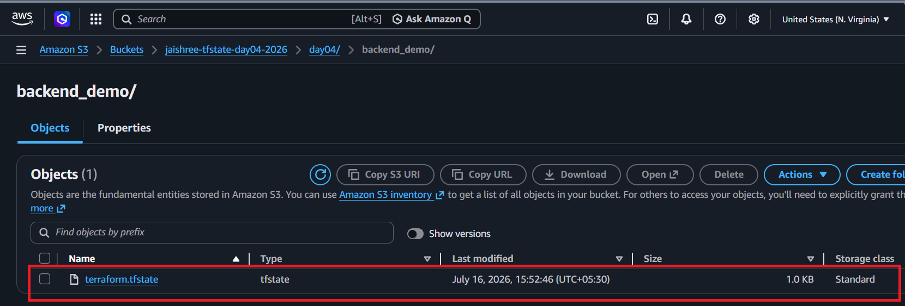

---

### Lock File

Verified the lock file used for native state locking.

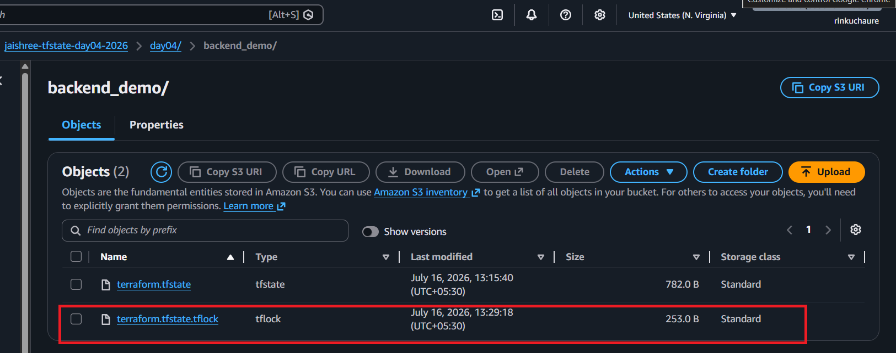

---

### Bucket Versioning

Verified that versioning is enabled on the Terraform state bucket.

```bash
aws s3api get-bucket-versioning --bucket jaishree-tfstate-day04-2026
```

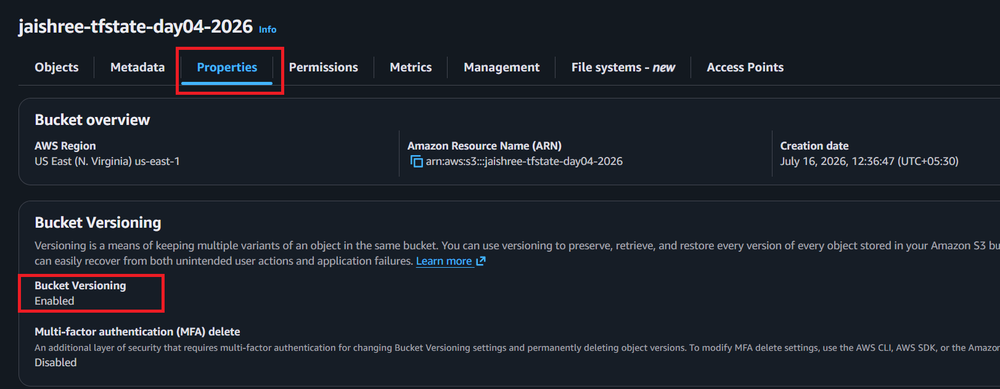

---
## Task 5: Import an Existing Resource

Terraform 1.5+ supports declarative imports using an `import` block, making it easy to bring existing infrastructure under Terraform management.

```hcl
import {
  to = aws_s3_bucket.imported
  id = "my-manually-created-bucket"
}
```

Generate and review the Terraform configuration using:

```bash
terraform plan -generate-config-out=generated.tf
```

---

### Imported Resource

Verified the manually created resource before importing it into Terraform.

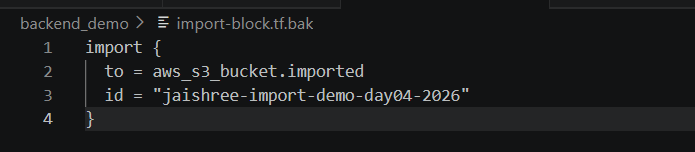

---

### Import Block Configuration

Configured the Terraform import block for the existing resource.

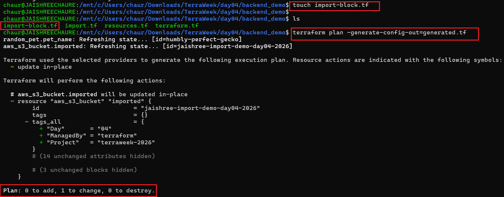

---

> **Reference:** The companion repository provides examples for Terraform import, moved, removed, and check blocks.
>
> - [`import.tf`](https://github.com/LondheShubham153/terraform-for-devops/blob/main/examples/import.tf)
> - [`moved.tf`](https://github.com/LondheShubham153/terraform-for-devops/blob/main/examples/moved.tf)
> - [`removed.tf`](https://github.com/LondheShubham153/terraform-for-devops/blob/main/examples/removed.tf)
> - [`check.tf`](https://github.com/LondheShubham153/terraform-for-devops/blob/main/examples/check.tf)

---

## Bonus Tasks

Implemented the following Terraform refactoring and validation features:

- `moved` block for safe resource refactoring.
- `removed` block to stop managing resources without deleting them.
- `check` block for infrastructure validation.
- S3 bucket versioning for state recovery.

---

### Moved Block

Safely refactored Terraform resource addresses without recreating infrastructure.

> 📄 **Code:** [`moved.tf`](./backend_demo/moved.tf)

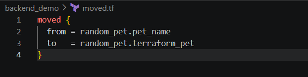

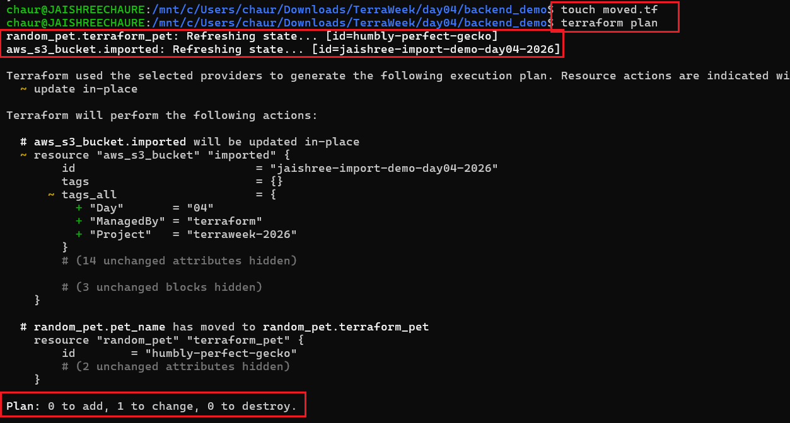

---

### Removed Block

Stopped managing Terraform resources without deleting the underlying infrastructure.

> 📄 **Code:** [`removed.tf`](./backend_demo/removed.tf)

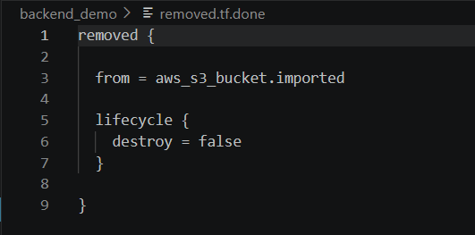

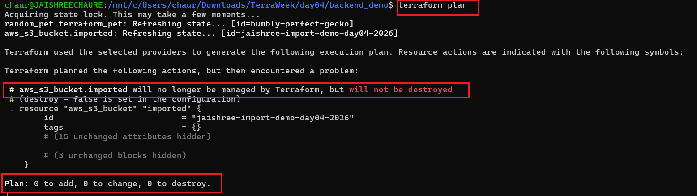

---

### Check Block

Added infrastructure assertions using Terraform's `check` block.

> 📄 **Code:** [`check.tf`](./backend_demo/check.tf)

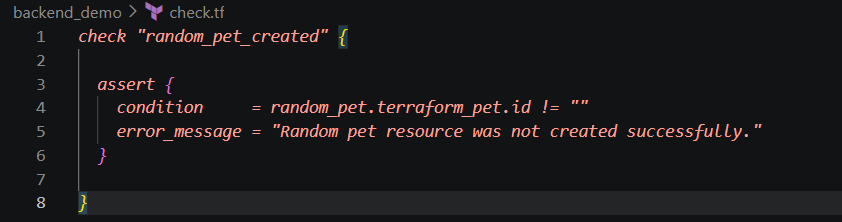

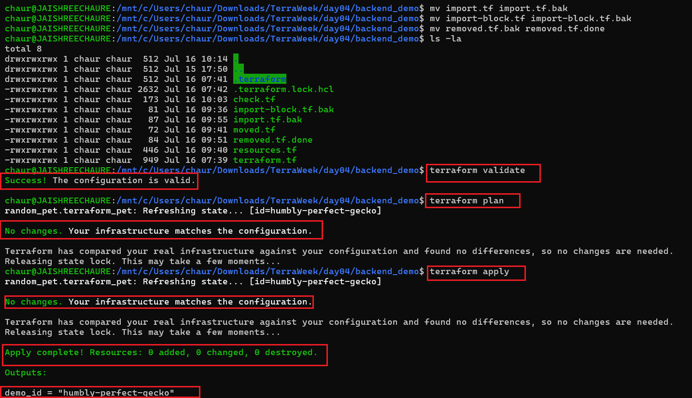

---

## Cleanup

Destroy all resources after completing the lab to avoid unnecessary AWS charges.

### Backend Infrastructure

```bash
terraform destroy
```

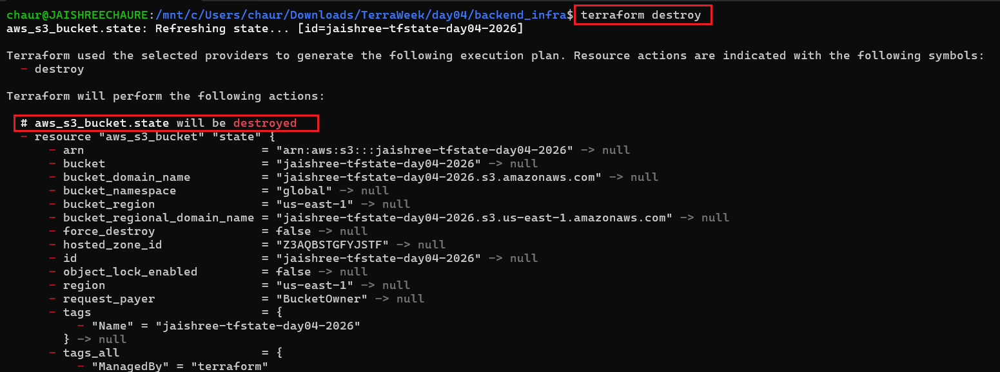

---

### Backend Demo

```bash
terraform destroy
```

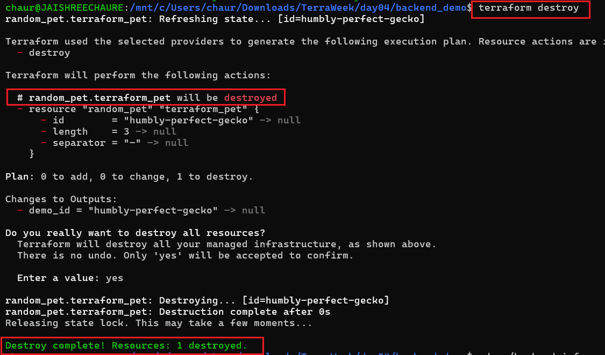

## Key Takeaways

- Terraform State is Terraform's source of truth.
- Remote backends improve collaboration and security.
- Native S3 locking replaces DynamoDB-based locking.
- Import blocks simplify onboarding existing infrastructure.
- Moved and Removed blocks enable safer refactoring.
- Check blocks help validate infrastructure continuously.
- S3 bucket versioning protects Terraform state files.
- Terraform state files should never be manually modified or committed to Git.