# 📦 TerraWeek Day 5 — Modules: Reusable, Composable Infrastructure

**Date:** Friday, 17th July 2026

Terraform modules help us write infrastructure once and reuse it across multiple projects and environments. In this hands-on lab, I created reusable modules, consumed modules from GitHub and the Terraform Registry, and explored module composition to build scalable Infrastructure as Code.

---

## Table of Contents

- [Learning Goals](#-learning-goals)
- [Prerequisites](#-prerequisites)
- [Estimated Cost](#-estimated-cost)
- [How to Run](#-how-to-run)
- [Notes](#-notes)
- [Architecture Diagram](#-architecture-diagram)
- [Infrastructure Summary](#-infrastructure-summary)
- [Project Structure](#-project-structure)
- [Task 1 - Terraform Modules Fundamentals](#task-1---terraform-modules-fundamentals)
- [Task 2 - Build and Consume a Local Terraform Module](#task-2---build-and-consume-a-local-terraform-module)
- [Task 3 - Module Reusability using for_each](#task-3---module-reusability-using-for_each)
- [Task 4 - Consume a Registry Module + Version Locking](#task-4---consume-a-registry-module--version-locking)
- [Task 5 - Publish Module to GitHub (Bonus)](#task-5---publish-module-to-github-bonus)
- [Task 6 - Module Composition (Bonus)](#task-6---module-composition-bonus)
- [Module Version Locking](#module-version-locking)
- [Git Module Version Pinning](#git-module-version-pinning)
- [Key Learnings](#key-learnings)
- [Cleanup](#cleanup)
- [Final Outcome](#final-outcome)

---

## 🎯 Learning Goals

- Understand what Terraform modules are and why they are important.
- Differentiate between root modules and child modules.
- Create and use reusable Terraform modules.
- Consume modules from GitHub using the `git::` source.
- Consume modules from the Terraform Registry.
- Explore module composition using module outputs as inputs.
- Learn module versioning using Git tags.

---

## Prerequisites

Before running this project, make sure you have:

| Requirement | Version / Details |
|------------|------------------|
| Terraform | v1.13.x or later |
| AWS CLI | Installed and configured |
| AWS Account | Active AWS account |
| IAM User | Programmatic access enabled |
| Git | Installed |
| GitHub Account | Required for publishing Terraform modules |
| Terraform Registry Access | Required for Registry module examples |
| Ubuntu / WSL | Recommended development environment |

---

## Estimated Cost

This project uses AWS Free Tier eligible resources where possible.

**Resources Used**
- EC2 (`t3.micro`)
- VPC & Public Subnets
- Security Groups
- Internet Gateway & Route Tables
- Terraform Modules (Local, GitHub, Registry)

> **Note:** Destroy resources after completing each lab to avoid unnecessary charges.

---

## How to Run

```bash
git clone <repository-url>
cd day05/<demo-directory>
```

Available demo directories:

```text
example/
registry-demo/
github-module-demo/
module-composition-demo/
```

Run Terraform commands:

```bash
terraform fmt
terraform init
terraform validate
terraform plan -out=tfplan
terraform apply tfplan
terraform output
terraform destroy
```

> **Note:** Run `terraform destroy` inside the respective demo directory when you're done.

---

## Notes

- AWS Region: `us-east-1`
- Free Tier EC2 Instance Type: `t3.micro`
- Terraform Version: `v1.15.8`
- AWS Provider Version: `~> 6.0`

Terraform Module Sources:
- Local Module
- Registry Module
- GitHub Module

Module Versioning:
- Git Tags (v1.0.0)
- Module versioning implemented using Git tags (`?ref=v1.0.0`)
- Infrastructure provisioned entirely using Terraform.
- All AWS resources were destroyed after completing the hands-on labs.

---

## Architecture Diagram

```text
                           Terraform Root Modules
                                      |
          -----------------------------------------------------------------
          |                          |                          |                          |
      Local Module              Registry Module            GitHub Module            Module Composition
          |                          |                          |                          |
      EC2 Instance                   VPC                    EC2 Instance            VPC + EC2 Modules
          |                          |                          |                          |
          -----------------------------------------------------------------
                                      |
                               AWS Infrastructure
                                      |
                    EC2 • VPC • Subnets • Security Groups
```

---

## Infrastructure Summary

| Resource | Value |
|---------|---------|
| Cloud Provider | AWS |
| AWS Region | `us-east-1` |
| EC2 Instance Type | `t3.micro` |
| Terraform Version | `v1.15.8` |
| AWS Provider Version | `~> 6.0` |
| Terraform Module Sources | Local, Registry, GitHub |
| Module Versioning | `?ref=v1.0.0` |
| Multi-Module Demo | Module Composition |
| Infrastructure Provisioning | Terraform |
| Cleanup | `terraform destroy` completed |

---

## Project Structure

```text
day05/
├── example/                  # Local module
├── registry-demo/            # Registry module
├── github-module-demo/       # GitHub module
├── module-composition-demo/  # Module composition
├── images/
├── day05.md
└── README.md
```

---

## 📝 Tasks

### Task 1 - Terraform Modules Fundamentals

#### What is a Terraform Module?

A Terraform module is a reusable collection of Terraform configuration files used to provision and manage infrastructure resources.

The **root module** is the working Terraform configuration from which Terraform commands are executed. Modules called by the root module are referred to as **child modules**.

#### Benefits of Terraform Modules

| Benefit | Description |
|--------|--------|
| Reusability | Reuse infrastructure code across projects and environments. |
| Consistency | Enforce standardized infrastructure deployments. |
| Encapsulation | Expose only required inputs and outputs while hiding implementation details. |
| Versioning | Manage module versions using Git tags and version constraints. |
| Testability | Validate and test modules independently before reuse. |

#### Standard Module Structure

| File | Purpose |
|------|------|
| `main.tf` | Defines infrastructure resources. |
| `variables.tf` | Defines module input variables. |
| `outputs.tf` | Exposes resource attributes and outputs. |
| `README.md` | Documents module usage and examples. |

```text
terraform-module/

├── main.tf
├── variables.tf
├── outputs.tf
└── README.md
```

> **Read More**
>
> Explore my detailed Terraform Modules notes for concepts, examples, and best practices:
> - [Terraform Modules Notes](https://github.com/Jaishree97/DevOps-Notes/blob/main/Terraform/09-modules.md)

---

## Task 2 - Build and Consume a Local Terraform Module

### What I Learned

- Created a reusable Terraform module for EC2 provisioning.
- Passed shared infrastructure values as module inputs.
- Consumed module outputs in the root module.
- Applied Terraform best practices and variable validation.

> 📄 **Code:** [`example/main.tf`](./example/main.tf)

### Overview

Built and consumed a reusable EC2 Terraform module by passing shared infrastructure values (AMI ID, Subnet ID, and Security Group IDs) from the root module to the child module.

### Architecture

```text
                 Root Module
                      |
                Passes Inputs
                      |
                      v
                  EC2 Module
                      |
                      v
                 EC2 Instance
                      |
                      v
                 Module Outputs
                      |
                      v
                Terraform Output
```
---

### Implementation Walkthrough

#### 1. Terraform Init

Initialized Terraform and downloaded the required providers and local modules.

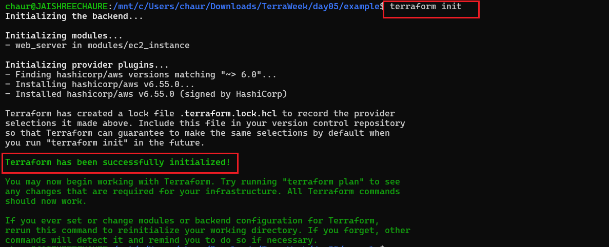

---

#### 2. Terraform Plan

Validated the configuration and reviewed the execution plan before provisioning resources.

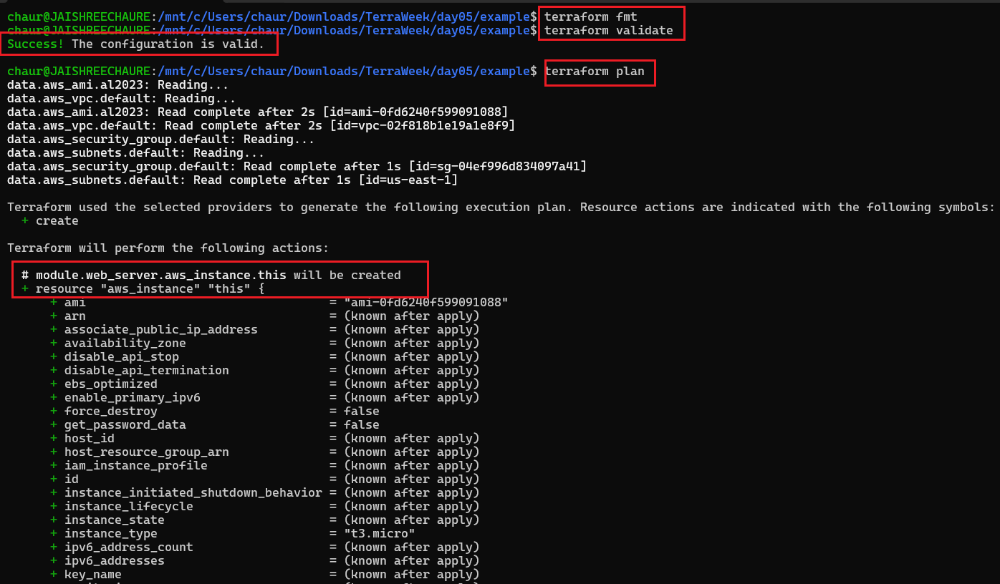

---

#### 3. Terraform Apply & Output

Provisioned the EC2 instance using the reusable local Terraform module.

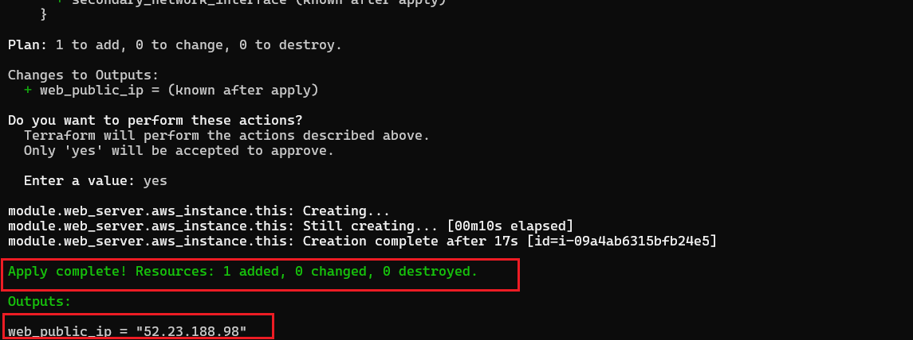

---

#### 4. AWS Console Verification

Verified that the EC2 instance was successfully created in the AWS Management Console.

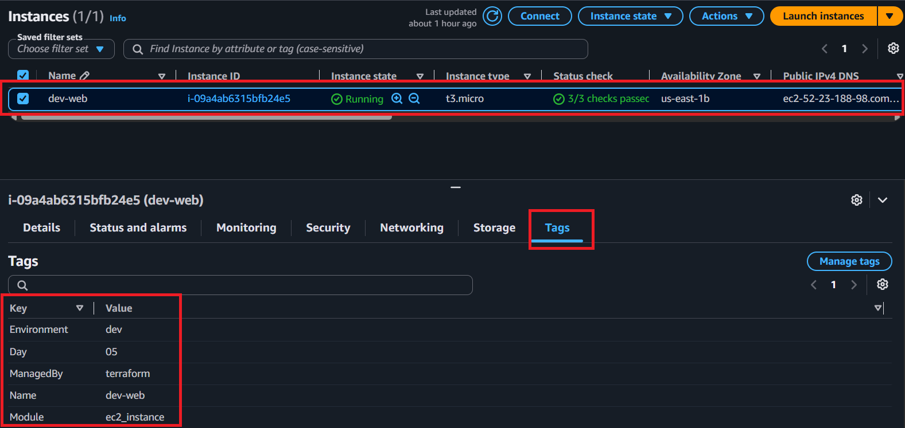

---

#### 5. Variable Validation Testing

Intentionally provided invalid inputs to verify Terraform's variable validation rules.

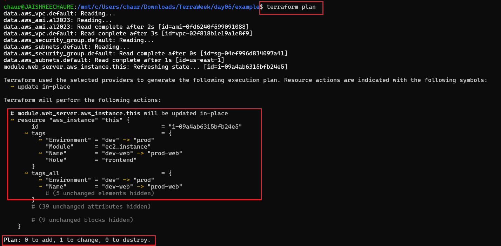

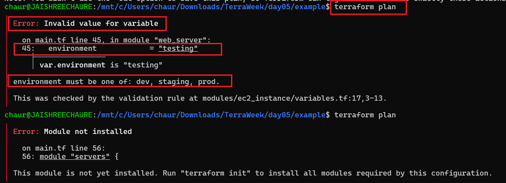

---


### Hands-on Completed

- Built a reusable EC2 Terraform module.
- Provisioned an EC2 instance using the local module.
- Verified module inputs and outputs.
- Validated the Terraform configuration.
- Destroyed all resources after completing the lab.

---

## Task 3 - Module Reusability using for_each

### What I Learned

- Reused the same Terraform module multiple times.
- Provisioned multiple EC2 instances using `for_each`.
- Generated dynamic module outputs.
- Verified Terraform and provider versions.

> 📄 **Code:** [`example/main.tf`](./example/main.tf)

### Overview

The `example/main.tf` file uses the `for_each` meta-argument to instantiate the same reusable EC2 module multiple times.

The following EC2 instances were provisioned from a single module definition:

- `app`
- `worker`
- `cache`

This demonstrates how Terraform modules can be scaled efficiently without duplicating infrastructure code.

### Architecture

```text
                  EC2 Module
                       |
                    for_each
                       |
        -----------------------------------
        |                 |               |
       app              worker           cache
        |                 |               |
   EC2 Instance      EC2 Instance     EC2 Instance
```

### Implementation Walkthrough

#### 1. Terraform Init

Initialized Terraform and installed the required providers and modules.

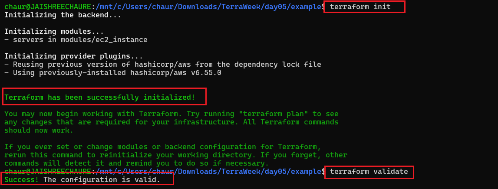

#### 2. Terraform Plan

Reviewed the execution plan for multiple EC2 instances.

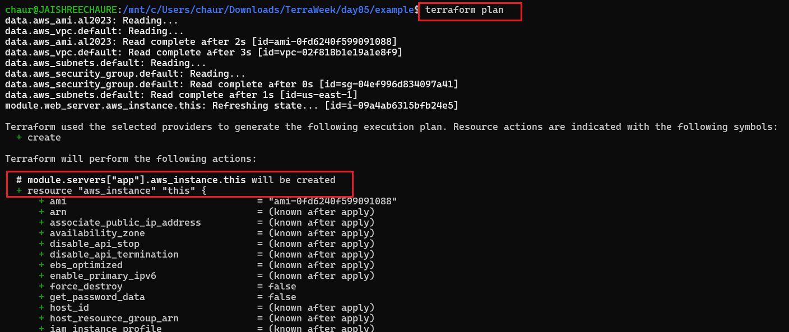

#### 3. Terraform Apply

Provisioned multiple EC2 instances using the reusable module.

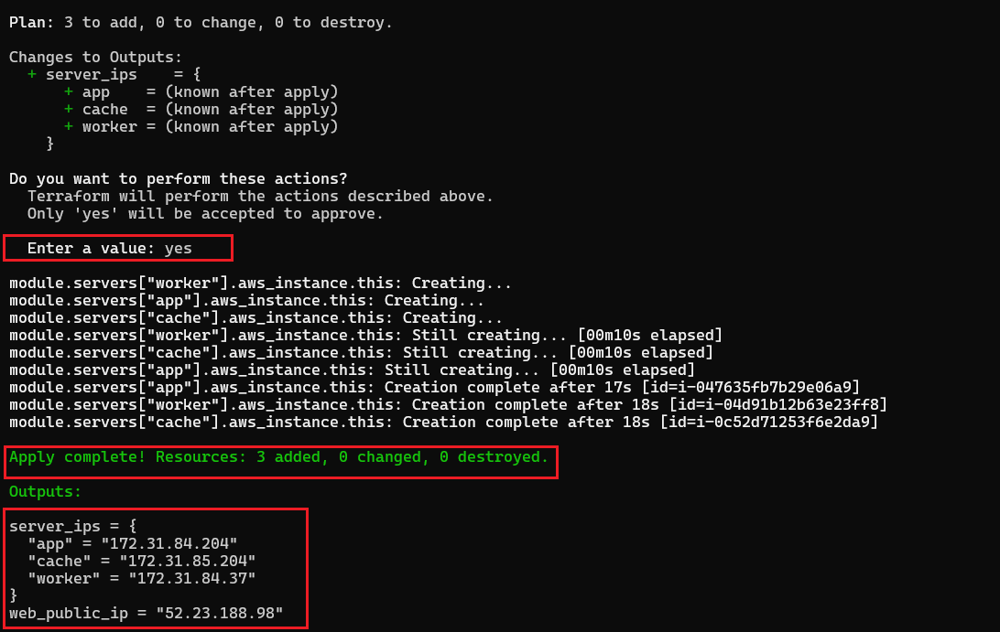

#### 4. AWS Console Verification

Verified the deployed EC2 instances in the AWS Management Console.

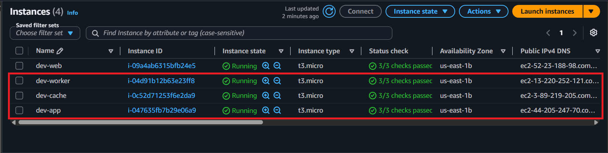

#### 5. Provider and Version Verification

Verified the Terraform and provider versions used during deployment.

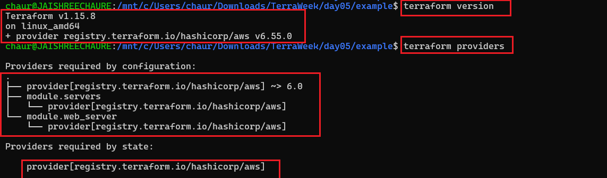

### Hands-on Completed

- Provisioned multiple EC2 instances using `for_each`.
- Reused the same Terraform module for multiple deployments.
- Verified the deployed resources in AWS.
- Validated Terraform and provider versions.
- Destroyed all resources after completing the lab.

---

## Task 4 - Consume a Registry Module + Version Locking

### What I Learned

- Consumed a module from the Terraform Registry.
- Applied module version locking using the `version` argument.
- Provisioned AWS networking resources using a community module.
- Verified the deployed infrastructure in the AWS Console.

> 📄 **Code:** [`registry-demo/main.tf`](./registry-demo/main.tf)

### Overview

Used the AWS VPC module from the Terraform Registry to provision networking resources while pinning the module version for predictable and reproducible deployments.

### Architecture

```text
                 Root Module
                       |
                       v
         terraform-aws-modules/vpc/aws
                       |
       -----------------------------------------
       |                  |                    |
      VPC            Public Subnets        Route Tables
                                                  |
                                            Internet Gateway
```

### Implementation Walkthrough

#### 1. Terraform Init

Downloaded and initialized the Terraform Registry module.

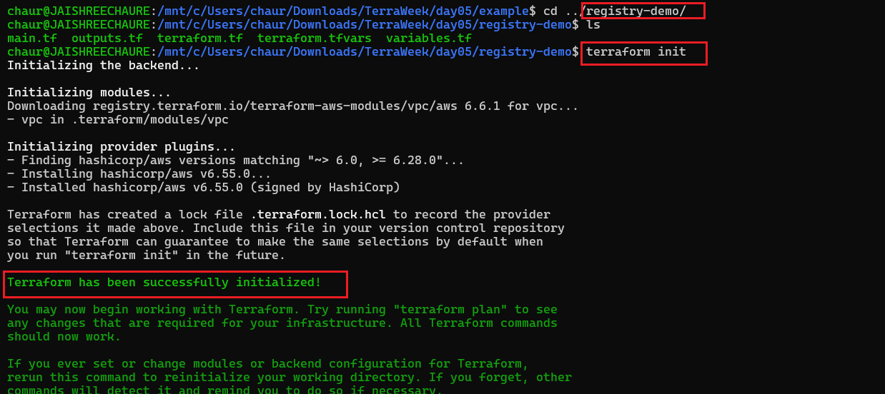

---

#### 2. Terraform Validate and Plan

Validated the configuration and reviewed the execution plan.

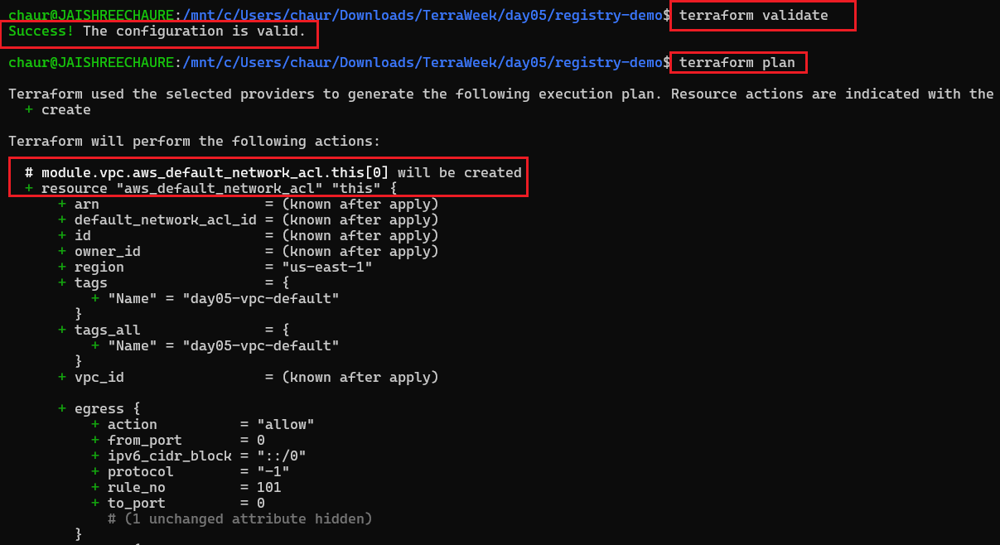

---

#### 3. Terraform Apply and Outputs

Provisioned the VPC infrastructure and verified Terraform outputs.

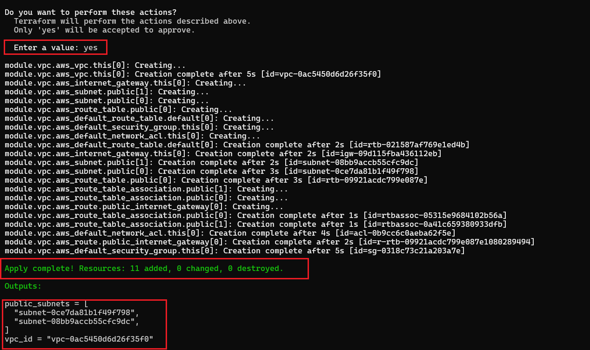

---

#### 4. AWS Console Verification - VPC

Verified that the VPC was successfully created in AWS.

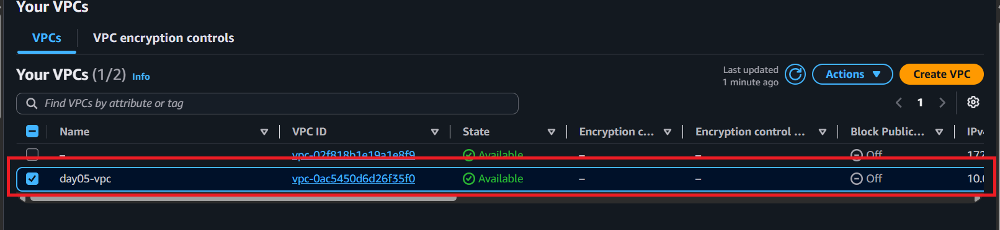

---

#### 5. AWS Console Verification - Public Subnets

Verified that the public subnets were created successfully.

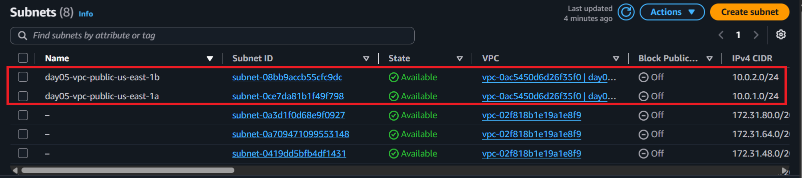

---

#### 6. AWS Console Verification - Route Tables

Verified that the public route table was configured correctly.

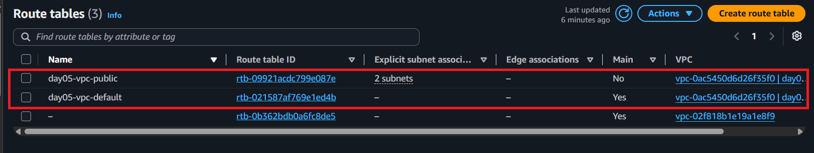

### Hands-on Completed

- Consumed an official Terraform Registry module.
- Applied module version locking for reproducible deployments.
- Provisioned a VPC with public subnets and route tables.
- Verified resources in the AWS Management Console.
- Destroyed all infrastructure after completing the lab.

---

## Module Version Locking

Terraform supports version pinning to ensure consistent and reliable module deployments.

### Registry Module

```hcl
version = "~> 6.0"
version = "= 6.0.0"
version = ">= 6.0, < 7.0"
```

### Git Tag

```hcl
source = "git::https://github.com/Jaishree97/terraform-aws-ec2-module.git?ref=v1.0.0"
```

### Git Commit SHA

```hcl
source = "git::https://github.com/org/repo.git?ref=<commit-sha>"
```

### Benefits

- Ensures reproducible deployments.
- Prevents breaking changes.
- Enables controlled module upgrades.

---

## Git Module Version Pinning

### `~>` Version Constraints

| Constraint | Allows |
|------------|--------|
| `~> 5.0` | `5.x` versions only |
| `~> 5.1.0` | `5.1.x` versions only |

---

### Published Module

- [terraform-aws-ec2-module](https://github.com/Jaishree97/terraform-aws-ec2-module)

---

### Module Composition Reference

- [AWS Module Project Reference](https://github.com/LondheShubham153/terraform-for-devops/tree/main/aws_module_project)

**Resources Provisioned**
- EC2
- S3
- DynamoDB

**Environments**
- Dev
- Staging
- Production

---

## Task 5 - Publish Module to GitHub (Bonus)

### What I Learned

- Published a reusable Terraform module to GitHub.
- Added module documentation and variable validations.
- Versioned the module using Git tags.
- Consumed the module using `git::` and `?ref=`.

> 📄 **Code:** [`github-module-demo/main.tf`](./github-module-demo/main.tf)

> 🔗 **Module Repository:**  
> [terraform-aws-ec2-module](https://github.com/Jaishree97/terraform-aws-ec2-module)

### Overview

Published a reusable EC2 Terraform module to GitHub and consumed it using a version-pinned Git source URL.

### Architecture

```text
              GitHub Repository
                      |
                 Git Tag (v1.0.0)
                      |
                      v
                Terraform Module
                      |
                 git:: + ?ref=
                      |
                      v
                  Root Module
                      |
                      v
                 EC2 Instance
```

### Implementation Walkthrough

#### 1. GitHub Repository Creation

Created a public GitHub repository to publish the reusable Terraform module.

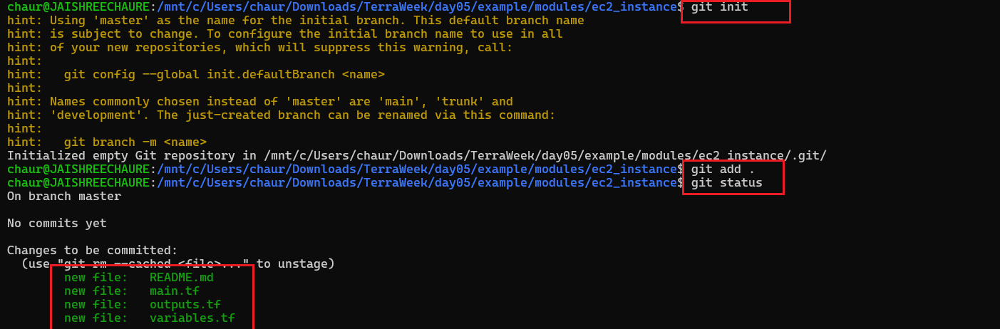

---

#### 2. Git Configuration Verification

Verified the Git configuration before committing and pushing the module code.

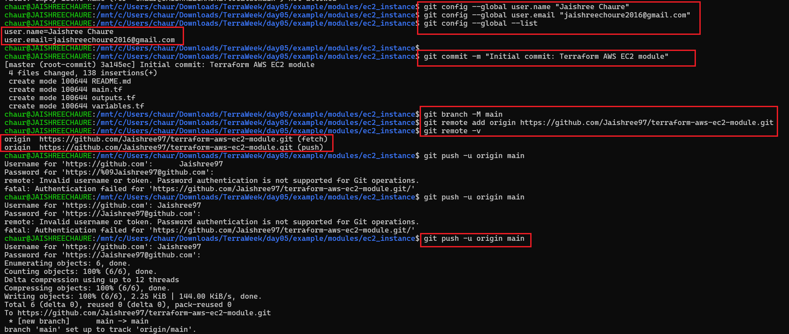

---

#### 3. Git Tag Creation and Push

Created and pushed the `v1.0.0` Git tag for module versioning.

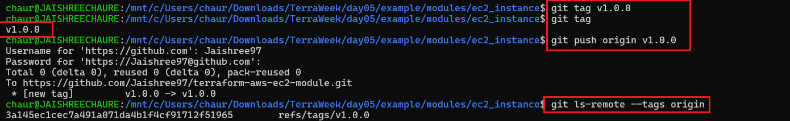

---

#### 4. Terraform Init

Initialized Terraform and downloaded the GitHub-hosted module.

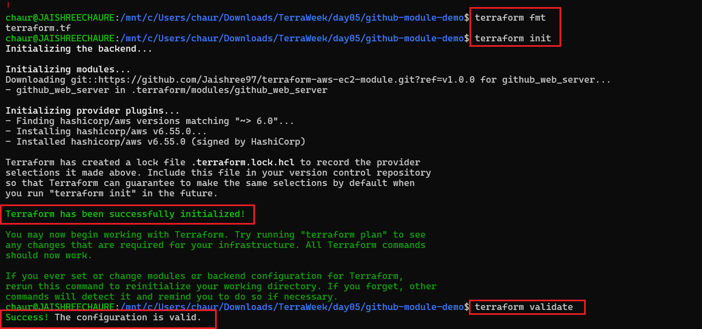

---

#### 5. Terraform Plan

Reviewed the execution plan before provisioning resources.

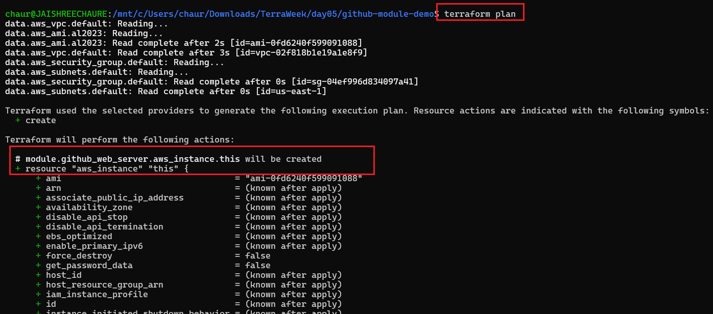

---

#### 6. Terraform Apply and Outputs

Provisioned the EC2 instance and verified the module outputs.

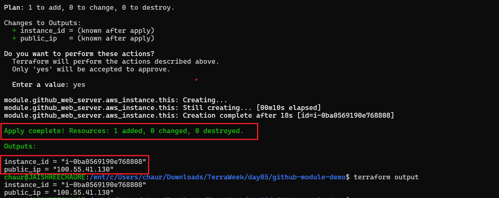

---

#### 7. AWS Console Verification

Verified the deployed EC2 instance in the AWS Management Console.

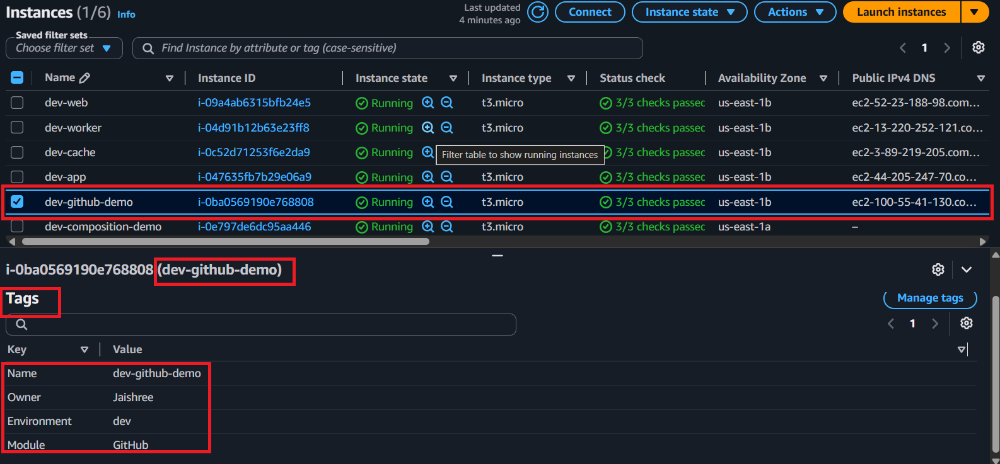

### Hands-on Completed

- Published a reusable Terraform module to GitHub.
- Versioned the module using Git tags (`v1.0.0`).
- Consumed the module using `git::` and `?ref=`.
- Verified the deployed EC2 instance.
- Destroyed all resources after completing the lab.

---

## Task 6 - Module Composition (Bonus)

### What I Learned

- Implemented Terraform module composition.
- Passed module outputs as inputs.
- Built modular and reusable infrastructure.

> 📄 **Code:** [`module-composition-demo/main.tf`](./module-composition-demo/main.tf)

### Overview

Provisioned infrastructure by composing multiple Terraform modules and passing outputs from the VPC module to the EC2 module.

### Architecture

```text
             VPC Module
                  |
               Outputs
                  |
                  v
             EC2 Module
                  |
                  v
             EC2 Instance
```

### Implementation Walkthrough

#### 1. Terraform Init

Initialized Terraform and downloaded the required modules.

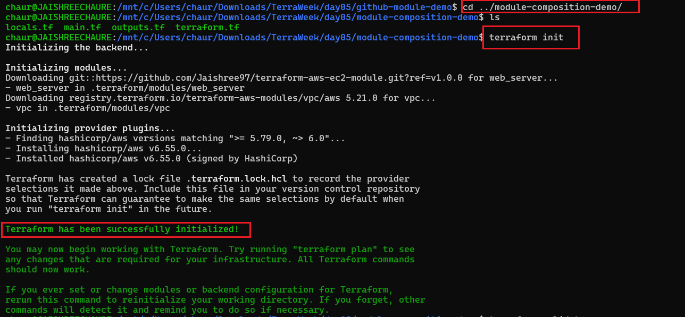

---

#### 2. Terraform Plan

Reviewed the infrastructure changes before deployment.

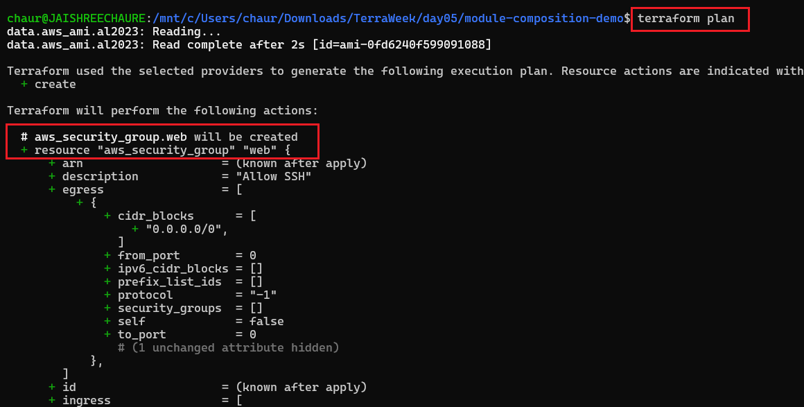

---

#### 3. Terraform Apply

Provisioned the infrastructure using module composition.

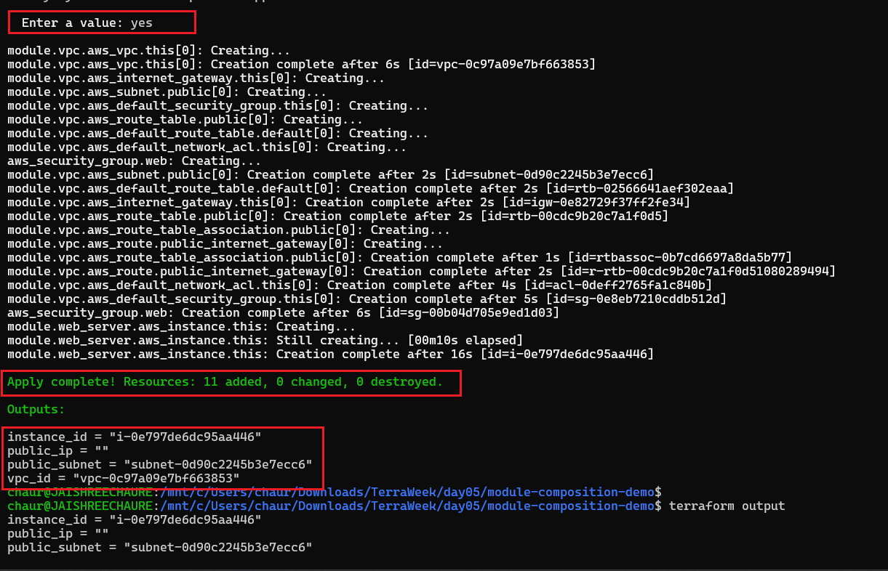

---

#### 4. AWS Console Verification

Verified the deployed EC2 instance in AWS.

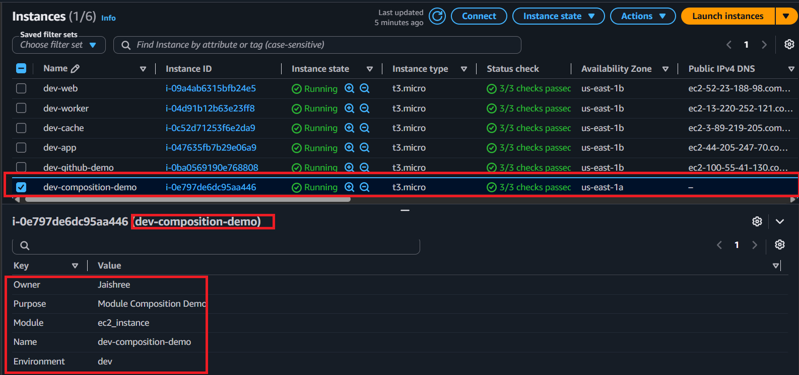

### Hands-on Completed

- Implemented module composition.
- Passed module outputs between modules.
- Verified the deployed resources.
- Destroyed all infrastructure after the lab.

---

## Key Learnings

- Terraform modules improve code reusability and maintainability.
- Module version locking provides predictable infrastructure deployments.
- Local, GitHub, and Registry modules can be consumed seamlessly.
- Module composition enables scalable Infrastructure as Code designs.
- Terraform validations improve module reliability and usability.

---

## Cleanup

All AWS resources provisioned during the hands-on labs were destroyed successfully to avoid unnecessary AWS charges.

```bash
terraform destroy
```

### Verification

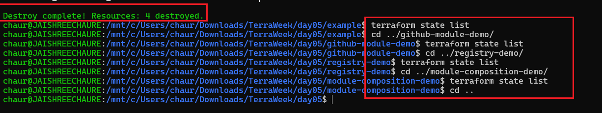

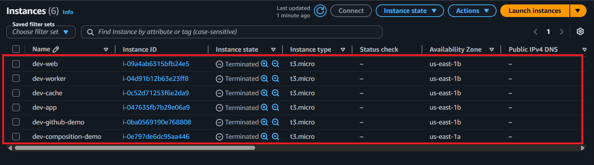

---

## Final Outcome

Successfully completed all mandatory and bonus tasks for TerraWeek Day 5 by implementing reusable Terraform modules, module versioning, Registry modules, GitHub modules, and module composition patterns.

By completing this lab, I was able to:

- Build reusable Terraform modules.
- Consume modules from local paths, GitHub, and the Terraform Registry.
- Implement module version locking using Registry versions and Git tags.
- Provision AWS infrastructure using modular Terraform configurations.
- Scale infrastructure deployments using `for_each`.
- Apply module composition patterns for reusable Infrastructure as Code.
- Follow Terraform module best practices and project organization.

---